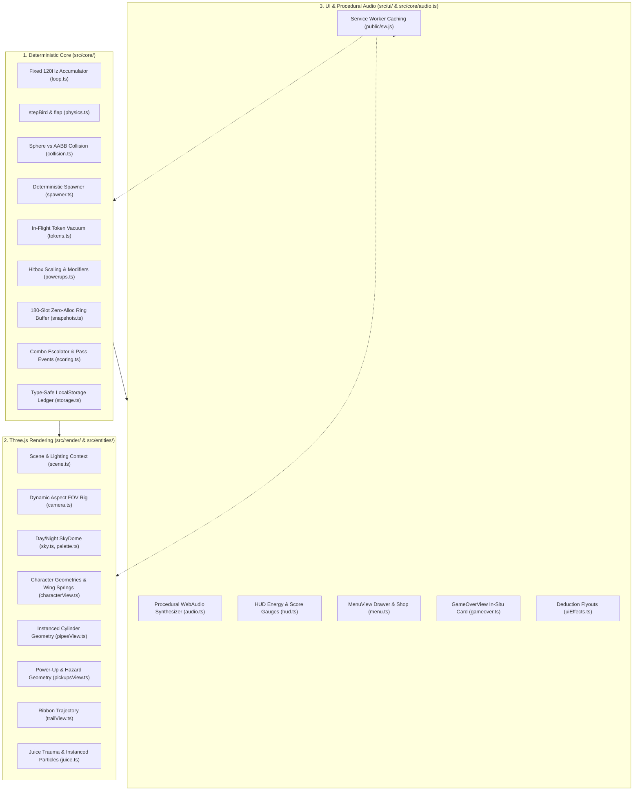

# AGENTS.md — FLOPY.SPACE Autonomous Agent Index 🪐🐱⚡

> **System & Codebase Knowledge Base for Autonomous Agents & AI Engineers**  
> Repository: `flopy.space` (`flopy_space`) | Stack: TypeScript (ES2022), Three.js (r174), WebAudio API, Vitest, Vite 6, PWA Service Worker.

---

## 1. Codebase Architecture & Systems Map

FLOPY.SPACE enforces strict **unidirectional data flow** with complete isolation between headless deterministic simulation, WebGL visual pipeline, procedural WebAudio synthesis, and responsive DOM overlays.



---

## 2. Resource Directory Index

| Path | Purpose & Key Modules |
| :--- | :--- |
| **`src/core/`** | **Headless Engine & Logic**: `loop.ts`, `physics.ts`, `collision.ts`, `spawner.ts`, `difficulty.ts`, `powerups.ts`, `tokens.ts`, `snapshots.ts`, `scoring.ts`, `fever.ts`, `biomes.ts`, `characters.ts`, `missions.ts`, `storage.ts`, `analytics.ts`, `constants.ts`, `types.ts`. |
| **`src/render/`** | **3D WebGL Pipeline**: `scene.ts` (renderer & lighting), `camera.ts` (FOV rig), `sky.ts` (dome shaders), `biomeVfx.ts` (atmospheric particle curtains). |
| **`src/entities/`** | **Visual Entity Views**: `characterView.ts` (hero meshes & skinning), `pipesView.ts` (pipe pool), `pickupsView.ts` (orbs & mines), `trailView.ts` (trajectory). |
| **`src/systems/`** | **Juice & Polish**: `juice.ts` (screenshake, trauma, particle bursts, screen border FX). |
| **`src/ui/`** | **DOM & Overlay Layer**: `hud.ts`, `menu.ts`, `gameover.ts`, `uiEffects.ts`, `installManager.ts`. |
| **`src/utils/`** | **Utilities**: `color.ts`, `dom.ts`, `time.ts`. |
| **`public/`** | **Static & PWA Assets**: `sw.js` (offline caching), `manifest.webmanifest`, `icon.svg`, `CNAME`. |
| **`tests/`** | **Test Suites**: Automated Vitest specs (`*.test.ts`) and Playwright E2E (`gameplay_automation.mjs`). |
| **`docs/`** | **Engineering Docs**: `ARCHITECTURE.md`, `README.md`, specs, plans, and `docs/research/` audits. |

---

## 3. Engineering Invariants & Performance Budget

1. **120Hz Fixed Physics Timestep**:
   $$\Delta t_{\text{fixed}} = \frac{1}{120}\text{s} \approx 0.008333\text{s}$$
   All simulation variables ($y$, $v_y$, pipe positions, moving kinematic offsets) depend strictly on discrete integer `tick`.
2. **Zero-Heap-Allocation Tick**:
   No object or array allocations during active 120Hz physics steps. Ring buffers (`SnapshotBuffer`), particle pools (`Juice`), and event pools (`processPasses`) mutate in-place.
3. **Collision Math: Sphere vs AABB**:
   Sphere center $(0, y_b, 0)$ with radius $r_{\text{eff}} = \text{getEffectiveHitboxRadius}(w)$ clamped against pipe bounding box:
   $$d^2 = (x_b - x_{\text{clamp}})^2 + (y_b - y_{\text{clamp}})^2 + (z_b - z_{\text{clamp}})^2 < r_{\text{eff}}^2$$
4. **Hitbox Modifiers**:
   - **Base**: $r_{\text{base}} = 0.3825\text{m}$ ($85\%$ visual radius).
   - **Chibi**: $r_{\text{chibi}} = r_{\text{base}} \times 0.55 \approx 0.210\text{m}$ ($0.45\times$ visual scale).
   - **Chubby**: $r_{\text{chubby}} = r_{\text{base}} \times 1.35 \approx 0.516\text{m}$ ($1.70\times$ visual scale + $30\%$ outer fluff buffer + 60 tick expansion invulnerability + $3\times$ coin multiplier).
5. **Procedural WebAudio**:
   Zero audio file downloads. 100% synthesized in real-time via WebAudio API with master `DynamicsCompressorNode` brickwall limiter.
6. **Mobile Touch & 0ms Latency**:
   `pointerdown` event listener with `touch-action: manipulation` suppresses mobile 300ms tap delay.
7. **Offline PWA Reliability**:
   Service Worker caches core app shell, fonts, and assets for 100% offline gameplay.

---

## 4. Development & Testing Commands

```bash
# Run unit & integration test suite (Vitest)
npm test

# Run specific test file
npx vitest run tests/indexing.test.ts

# Start local Vite development server
npm run dev

# Compile TypeScript and build production bundle
npm run build

# Preview production build locally
npm run preview

# Run headless Playwright E2E automation
npm run test:e2e
```

---

## 5. Security & Storage Rules for Agents

- **No `innerHTML` Interpolation**: Never interpolate dynamic strings, localStorage data, or user inputs into `innerHTML`. Use `textContent` or programmatic DOM creation (`document.createElement`).
- **Safe JSON Parsing**: Always parse `localStorage` arrays using `safeParseArray()` to prevent `TypeError` crashes on corrupted state.
- **Production Debug Invariant**: Never expose `window.__FLOPY_GAME__` in production; guard strictly behind `import.meta.env.DEV`.
- **Atomic State Transitions**: Mutate `localStorage` atomically with validated non-negative numbers.
