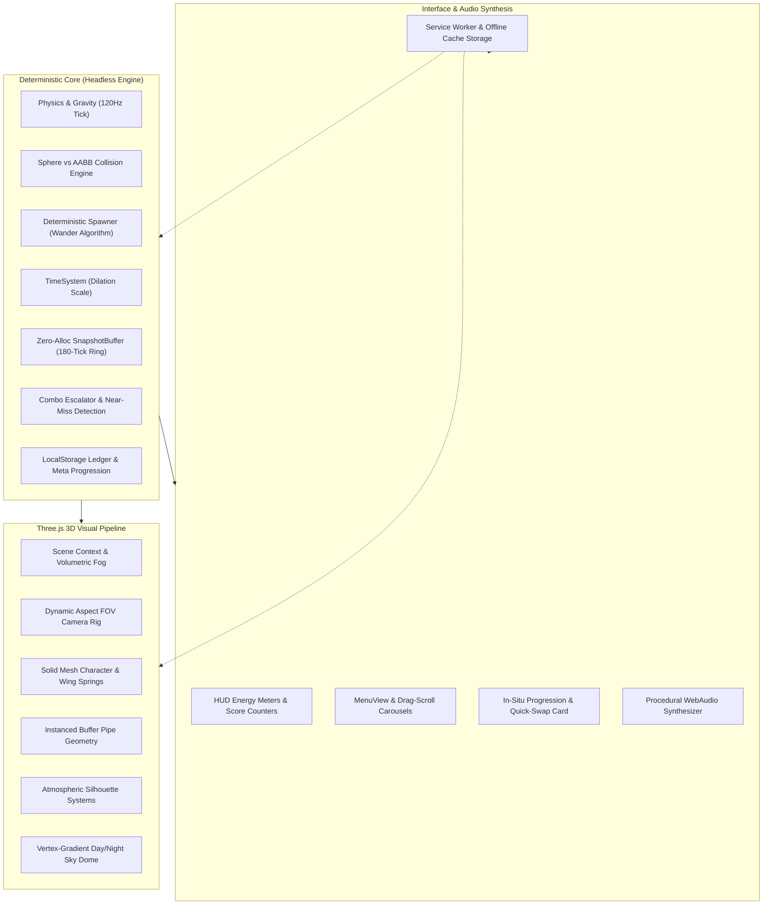
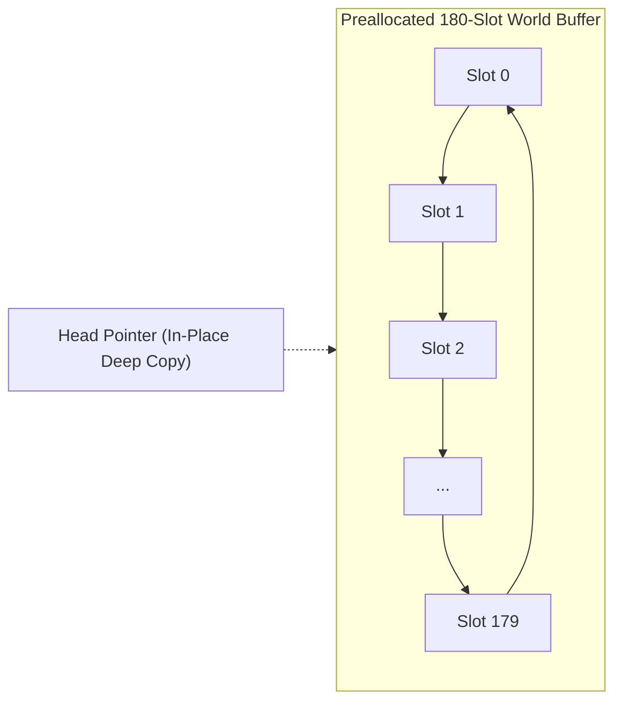
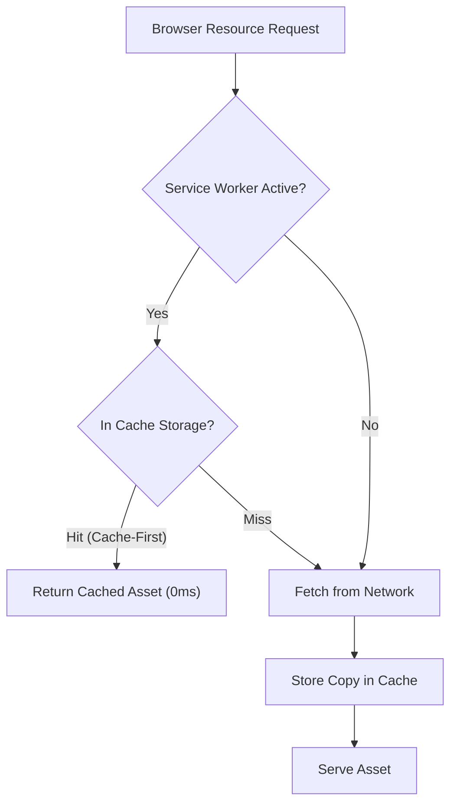
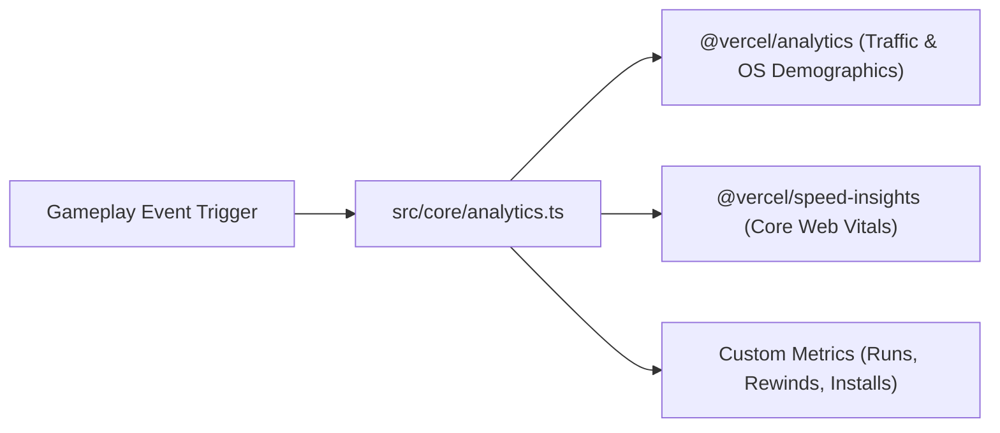
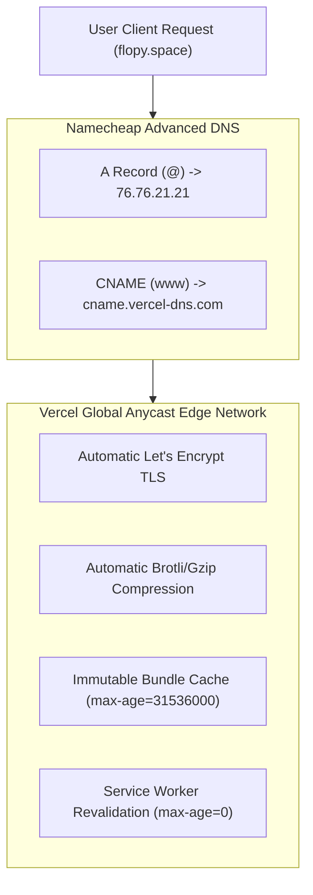
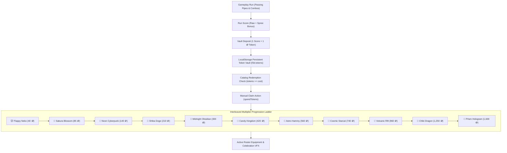

# FLOPY.SPACE Architecture & Systems Specification 🪐📐

> **Comprehensive architectural documentation for FLOPY.SPACE — A deterministic 3D arcade flyer with 4D time manipulation, WebGL rendering, and procedural WebAudio.**

---

## 1. System Overview

FLOPY.SPACE is designed with strict **unidirectional data flow** and a clean separation between the headless deterministic physics simulation, the Three.js 3D rendering pipeline, procedural WebAudio sound synthesizer, and the responsive DOM interface.

---

## 2. Core Simulation & Physics (120Hz Tick)

### 2.1 Fixed-Timestep Accumulator
The core simulation runs at a fixed $120\text{Hz}$ ($\Delta t = 8.33\text{ms}$) physics timestep:

$$\Delta t_{\text{fixed}} = \frac{1}{120} \approx 0.008333\text{s}$$

When the browser renders frames at variable delta times ($60\text{Hz}$, $90\text{Hz}$, $120\text{Hz}$), the accumulator consumes integer fixed ticks. This guarantees:
1. Exact cross-device determinism.
2. Identical jump trajectories and collision precision regardless of device refresh rate.
3. Perfect replay fidelity during 4D time rewind.

### 2.2 Collision Math: Sphere vs AABB
- **Hero Hitbox**: Modeled as a sphere at center $(x_b, y_b, z_b)$ with radius $r = 0.28\text{m}$.
- **Pipe Hitbox**: Modeled as two 3D Axis-Aligned Bounding Boxes (AABBs): Top pipe and Bottom pipe.
- **Distance Formula**: Clamps sphere center to box bounds $(x_{\text{clamp}}, y_{\text{clamp}}, z_{\text{clamp}})$:

$$d^2 = (x_b - x_{\text{clamp}})^2 + (y_b - y_{\text{clamp}})^2 + (z_b - z_{\text{clamp}})^2$$

$$\text{Collision} \iff d^2 \le r^2$$

---

## 3. 4D Time Mechanics & Zero-Allocation Ring Buffer

### 3.1 Snapshot Ring Buffer (`SnapshotBuffer`)
To allow players to rewind death by $1.5\text{s}$ ($180$ ticks), world states are continuously recorded into a preallocated circular ring buffer.

- **Zero Garbage Collection**: Preallocates 180 static `World` structs. Scalar properties and pipe buffers are mutated in-place with $0$ heap allocations per tick.
- **Safe Runway Algorithm**: Scans back $\approx 1.5\text{s}$ in the past to find a snapshot where the hero has cleared the previous obstacle and has ample forward runway ($\text{pipe.x} \ge 3.2\text{m}$) before resuming.

---

## 4. WebGL Rendering & Performance Architecture

### 4.1 Responsive Camera Rig (`CameraRig`)
The camera dynamically adjusts FOV and $Z$-distance based on the mobile device aspect ratio ($w / h$):

- **Portrait Screens ($9:16$, $9:19.5$)**: Widens vertical FOV and shifts back in $Z$ ($z \approx 13.5\text{m}$) so upcoming obstacles on the right are framed with generous reaction sightlines.
- **Landscape / Desktop**: Frames the horizontal band smoothly at $z \approx 10.5\text{m}$.

### 4.2 Zero-Allocation Render Loop
- **Static Projection Vectors**: Preallocated module-level `_worldPopupVec` and `_tempVec` avoid per-frame `new THREE.Vector3()` churn.
- **In-Place Material Updates**: Scene day/night lighting and ground colors mutate existing material properties via `.setHex()` without creating orphan shader programs.

---

## 5. Procedural WebAudio Synthesizer

FLOPY.SPACE downloads **zero audio files**. All sound effects and musical chords are synthesized in real-time via the WebAudio API:

| Sound Effect | Synthesis Technique | Frequency / Waveform |
| :--- | :--- | :--- |
| **Flap** | Bandpass filtered noise burst + pitch envelope | Sine sweep $180\text{Hz} \to 80\text{Hz}$ |
| **Score Chimes** | Additive dual-sine chime with exponential decay | $E_5, G^\sharp_5, B_5, E_6$ chord notes |
| **Death Crunch** | Distortion overdrive + low-frequency square thump | $120\text{Hz} \to 30\text{Hz}$ with noise |
| **Rewind Whoosh** | Reverse frequency sweep with resonant bandpass | $80\text{Hz} \to 880\text{Hz}$ reverse envelope |
| **Slow-Mo Orb** | Shimmering FM synth bells with detuned oscillators | $440\text{Hz} / 884\text{Hz}$ frequency modulation |

---

## 6. Offline PWA & Service Worker Caching

- **Precached Core**: `index.html`, `manifest.webmanifest`, `icon.svg`, and hashed Vite bundles.
- **Font Caching**: Cache-first for Google WebFonts (`.woff2`) and stale-while-revalidate for stylesheets.
- **Native Installation**: Intercepts `beforeinstallprompt` on Android Chromium and provides custom Add-to-Home-Screen instructions on iOS Safari.

---

## 7. Analytics, Telemetry & Web Vitals

- **Zero-PII Compliance**: No cookies or sensitive user telemetry collected (GDPR compliant).
- **Tracked Custom Invariants**:
  - `game_start`: Character, skin, biome, daily streak count.
  - `game_over`: Score, best, pipes passed, duration, rewinds used.
  - `pwa_install`: Install prompt acceptance vs dismissal rate.
  - `rewind_used`: 4D temporal rewind engagement point.
  - `quest_claim`: Daily quest completion and feather accumulation.

---

## 8. Edge Hosting & DNS Architecture

- **Rollup Three.js Chunking**: `vendor-three` ($122\text{kB}$ gzip) is separated from core gameplay code ($33\text{kB}$ gzip) to maximize browser cache hit rates across subsequent updates.
- **HTTP Security Headers**: Enforces `X-Content-Type-Options: nosniff`, `X-Frame-Options: SAMEORIGIN`, and strict referrer policies via `vercel.json`.

---

## 9. Token Economy & Interleaved Progression Engine 🪙✨

### 9.1 Economy Model & Invariants
1. **Accrual**:
   - Run termination (`gameOver`) deposits the final run score 1:1 into spendable `f3d.tokens`.
   - In-flight collected gold coins atomically deposit into `f3d.tokens` immediately upon collection.
2. **In-Flight Mario-Style Token Trails & Dynamic Pipe Corridors**:
   - **5 Risk/Reward Topologies**: High-Ceiling Danger Arc, Low-Ground Skimmer, S-Curve Wave, The Fork, and Breather Diamond.
   - **Dynamic Spacing Expansion**: Spawns every 3–6 pipes with corridor widening ($11.0 \to 14.85$ units, +35% runway) and vertical gap expansion ($+0.8$ units) for safe, exhilarating acrobatics.
   - **Kinematic Reachability Constraint**: Token height $\Delta y$ is dynamically clamped against target pipe gap boundaries.
3. **Magnetic Suction Physics & Audio Arpeggio**:
   - **Vortex Suction**: Super Magnet 🧲 and Fever Rush draw tokens within $8.5$ units into the bird mouth with golden particle trails.
   - **Pentatonic Chimes**: 60ms throttled WebAudio arpeggios ($C_5 \to D_5 \to E_5 \to G_5 \to A_5 \to C_6$).
4. **Interleaved Scaled Ladder**:
   - Rebalanced from $40 \to 1,600\text{ 🪙}$ to account for in-flight coin influx while preserving aspirational long-term retention.
5. **Unified Action CTA & Zero Give-Up Invariant**:
   - Primary action button maintains fixed bottom position (`54px`), displaying `⚡ FLY AGAIN` at 0 feathers and transforming into `⚡ REWIND & RESUME (−1 🪶)` when feathers are banked or claimed in situ.
   - "Give Up" button is suppressed when `feathers > 0`, and Spacebar defaults to `chooseRewind()`.

