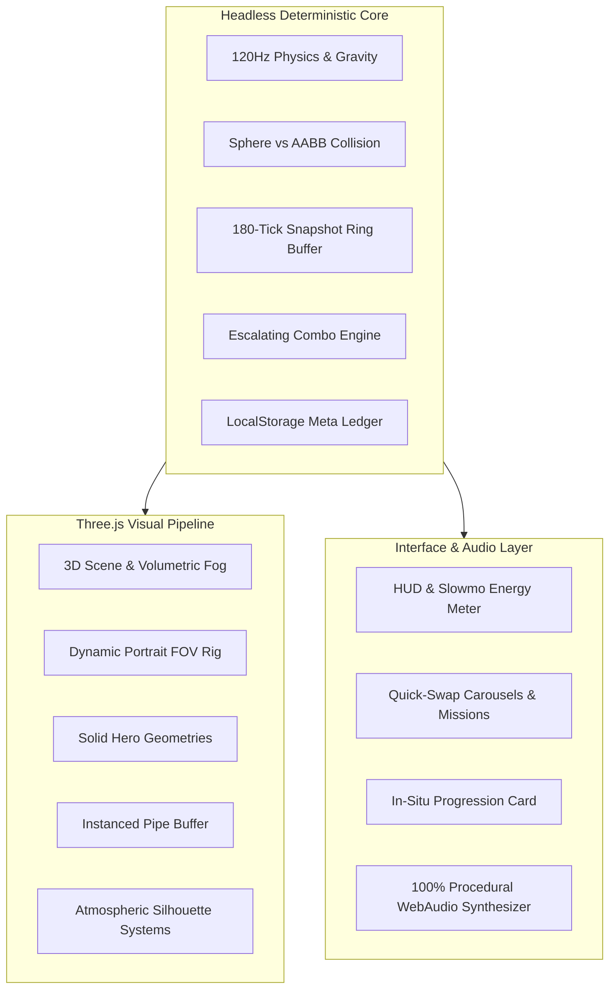

# FLOPY.SPACE 🪐🐱⚡

> **The next-generation 3D arcade flyer with 4D time manipulation, cute animal heroes, and procedural WebAudio.**

[](https://seintun.github.io/flopy.space/)
[](LICENSE)
[](https://threejs.org/)

---

## 🎮 Play Instantly in Any Browser

📱 **Mobile Optimized**: Add to Home Screen as a standalone PWA with 0ms touch latency.  
💻 **Desktop**: Full 120Hz/60Hz keyboard and spacebar support.

👉 **[https://seintun.github.io/flopy.space/](https://seintun.github.io/flopy.space/)**

---

## ✨ Key Features

### ⏳ 1. 4D Time Mechanics
- **Death Rewind (Time Travel)**: Spend banked feathers $\🪶$ on collision to rewind time $1.5\text{s}$ into the past, resume with 1 second of invulnerability, and keep your run alive!
- **Temporal Bullet-Time Orbs**: Pick up glowing clock orbs to ease the universe into cinematic slow-motion ($0.35\times$) for 3 real seconds while retaining snappy flight control.

### 🐱 2. Hero Roster & Customization
- **Classic Peep** 🐥 (OG Arcade Flyer)
- **Flappy Neko** 🐱 (Lucky Cat with pointy ears & fluffy meows — Unlock at score 15)
- **Shiba Doge** 🐶 (Hero cape & meme energy — Unlock at score 35)
- **Astro Hammy** 🐹 (Space bubble saucer & jet thrusters — Unlock at score 60)
- **Chibi Dragon** 🐲 (Flame Drake with fiery horns — Unlock at score 100)

### 🌍 3. Dynamic Atmospheric Worlds
- Auto-rotates smoothly every **15 pipes passed**:
  - 🌿 **Emerald Meadow**: Sunny skies & drifting horizon clouds
  - 🌆 **Neon Cyberpunk**: Synthwave grid & sweeping laser searchlights
  - 🍭 **Candy Kingdom**: Pastel cotton-candy plains
  - 🌋 **Volcanic Rift**: Basalt obsidian crust & distant mountain peaks

### 🎁 4. Addictive Meta Progression
- **In-Situ Quick Swap**: Swap heroes and biomes directly on the post-run card with zero menu friction.
- **Daily Quests & Streaks**: Earn feathers and bonuses with daily rotating mission challenges.
- **Strict Run Integrity**: Multipliers and spree bonuses track $100\%$ cleanly to the active hero.

---

## 🛠️ Architecture & Tech Stack



---

## 🚀 Local Development

```bash
# Clone the repository
git clone git@github.com:seintun/flopy.space.git
cd flopy.space

# Install dependencies
npm install

# Start Vite dev server
npm run dev

# Run Vitest test suite
npm test

# Build production bundle
npm run build
```

---

## 🕹️ Controls

- **Mobile / Touch**: Tap anywhere on screen to flap. Touch-drag carousels to browse heroes & scenes.
- **Desktop**: Press `[Spacebar]` or left click to flap.
- **Audio Toggle**: Tap `🔊` icon on top right to mute/unmute procedural sound synthesizer.

---

## 📄 License

MIT © [Sein Tun](https://github.com/seintun)

