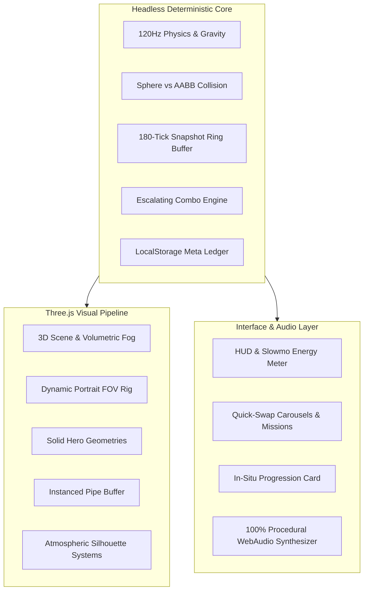

# FLOPY.SPACE 🪐🐱⚡

> **The next-generation 3D arcade flyer with 4D time manipulation, cute animal heroes, and procedural WebAudio.**

[](https://flopy.space/)
[](https://flopy.space/)
[](LICENSE)
[](https://threejs.org/)

---

## 🎮 Play Instantly in Any Browser

📱 **Mobile Optimized**: Add to Home Screen as a standalone PWA with 0ms touch latency.  
💻 **Desktop**: Full 120Hz/60Hz keyboard and spacebar support.

- 🌐 **Primary Domain**: **[https://flopy.space/](https://flopy.space/)**
- 🚀 **GitHub Mirror**: **[https://seintun.github.io/flopy.space/](https://seintun.github.io/flopy.space/)**

---

## ✨ Key Features

### ⏳ 1. 4D Time Mechanics
- **Death Rewind (Time Travel)**: Spend banked feathers $\🪶$ on collision to rewind time $1.5\text{s}$ into the past, resume with 1 second of invulnerability, and keep your run alive!
- **Unified Action CTA**: The post-run action button occupies a prominent, fixed bottom position (`⚡ FLY AGAIN`), instantly transforming into `⚡ REWIND & RESUME (−1 🪶)` whenever feathers are banked or claimed in situ.
- **Zero-Give-Up Invariant**: When feathers are available, distracting "Give Up" buttons are suppressed, keeping the focus entirely on reviving your best run.
- **Temporal Bullet-Time Orbs**: Pick up glowing clock orbs to ease the universe into cinematic slow-motion ($0.35\times$) for 3 real seconds while retaining snappy flight control.

### 🐥 2. Scale Shifters & Quirky Hitbox Modifiers
- **🐥 Chibi Nano Orb (0.55x Hitbox)**: Shrinks hero to nano scale with $+20\%$ flap agility, slipping through hairline clearances.
- **🐡 Chubby Chonker Orb (1.35x Hitbox & Wager Multiplier)**: Inflates hero to giant balloon with soft outer fluff buffer. Awards **$+3\times$ Coins & $+3$ bonus score per pipe cleared** while active!
- **Anti-Fat-Trap Grace**: Instant expansion grants $0.5\text{s}$ invulnerability shimmer to eliminate unfair obstacle contact on pickup.

### 🌊 3. Deterministic Kinetic Moving Pipelines
- **Sine Wave Bobbers**: Top and bottom pipes oscillate in harmonic phase ($y(t) = y_{\text{base}} + A \sin(\omega t + \phi)$).
- **Accordion Breathing Gaps**: Pipe gaps dynamically expand and contract with guaranteed fair minimum clearance ($\ge 3.1\text{ units}$).
- **100% 4D Rewind Determinism**: All obstacle kinematics compute strictly from discrete world tick $t = \text{tick} \times \text{DT}$, restoring bit-identical positions during time rewind.

### 🐱 4. Spendable Token Economy & Interleaved Progression
- **🪙 Token Vault**: Every run score earns spendable tokens (1 point = 1 🪙 token) deposited into your persistent vault.
- **🪜 Interleaved Multiplier Ladder**: Unlock 11 unique Heroes, Skins, and Worlds with an escalating cost schedule:
  - 🐱 **Flappy Neko** (25 🪙) $\to$ 🌸 **Sakura Blossom Skin** (50 🪙) $\to$ 🌆 **Neon Cyberpunk Scene** (75 🪙) $\to$ 🐶 **Shiba Doge** (110 🪙) $\to$ 🌌 **Midnight Obsidian Skin** (160 🪙) $\to$ 🍭 **Candy Kingdom Scene** (220 🪙) $\to$ 🐹 **Astro Hammy** (300 🪙) $\to$ 🔮 **Cosmic Starcat Skin** (400 🪙) $\to$ 🌋 **Volcanic Rift Scene** (520 🪙) $\to$ 🐲 **Chibi Dragon** (660 🪙) $\to$ 💎 **Prism Hologram Skin** (820 🪙).
- **🎁 Manual Claim Dopamine**: Glowing claim cards with floating `-XX 🪙` deduction animations, 3D sparkle bursts, and fanfare audio.

### 🌍 5. Dynamic Atmospheric Worlds
- Auto-rotates smoothly every **15 pipes passed** or selectable in roster:
  - 🌿 **Emerald Meadow**: Sunny skies & drifting horizon clouds
  - 🌆 **Neon Cyberpunk**: Synthwave grid & sweeping laser searchlights
  - 🍭 **Candy Kingdom**: Pastel cotton-candy plains & peppermint pillars
  - 🌋 **Volcanic Rift**: Basalt obsidian crust & glowing magma pillars

### 🔊 6. Procedural WebAudio & Hero Voiceprints
- **Zero Audio Downloads**: $100\%$ synthesized in real-time with WebAudio API.
- **Species-Specific Voiceprints**:
  - 🐱 **Flappy Neko**: Velvety purr-flutter, high squeak near-miss, comical deflating meow.
  - 🐶 **Shiba Doge**: Airy boof, excited *"yip!"*, cartoon hollow whine.
  - 🐲 **Chibi Dragon**: Low bass ember whoosh, fiery hiss, sub-bass growl.
  - 🐹 **Astro Hammy**: Jet thruster pulse, chirpy squeal, spring boing.
- **Master Brickwall Limiter**: `DynamicsCompressorNode` eliminates all digital clipping distortion during high-density multi-voice chord events.
- **Ascending Musical Arpeggios**: 2-octave pentatonic scale cascades for consecutive coin collections.

### 🔄 7. Addictive Retention & 0ms Frictionless Retry
- **0ms Tap-to-Skip Restart**: Tapping during 3-2-1 countdown immediately launches into flight with zero pause.
- **Dynamic Near-Record Callouts**: Game over displays glowing banners (`"SO CLOSE! Only X pipes from New Record!"`) to drive instant retry adrenaline.
- **Transparent Feather UX**: Dedicated "Save Feathers & End Run" button gives players full control over when to bank vs spend revivals.
- **Zero-GC DOM Popup Pool**: 12 pre-allocated floating text containers eliminate garbage collection stutter on low-memory mobile CPUs.

---

## 🛠️ Architecture & Tech Stack



---

## 🚀 Local Development

```bash
# Clone the repository
git clone git@github.com:seintun/flopy.space.git
cd flopy.space

# Install dependencies
npm install

# Start Vite dev server
npm run dev

# Run Vitest test suite
npm test

# Build production bundle
npm run build
```

---

---

## 📖 Architecture & Deep Systems

For detailed engineering specifications on fixed $120\text{Hz}$ physics, sphere-vs-AABB collision math, zero-allocation ring buffers, procedural WebAudio synthesis, and WebGL render pipelines, see **[ARCHITECTURE.md](ARCHITECTURE.md)**.

---

## 📱 PWA & Offline Standalone Installation

FLOPY.SPACE is a Progressive Web App (PWA) with full offline caching:
- **Android / Chrome / Desktop**: Tap the in-game **`📲 INSTALL`** button or browser install icon to install as a standalone app.
- **iOS Safari**: Tap the **Share** button `⎋` $\rightarrow$ **Add to Home Screen** `⊞`.
- **Offline Ready**: Works $100\%$ offline on airplane mode without internet access.

---

## 🕹️ Controls

- **Mobile / Touch**: Tap anywhere on screen to flap. Touch-drag carousels to browse heroes & scenes.
- **Desktop**: Press `[Spacebar]` or left click to flap.
- **Audio Toggle**: Tap `🔊` icon on top right to mute/unmute procedural sound synthesizer.

---

## 📄 License

MIT © [Sein Tun](https://github.com/seintun)

