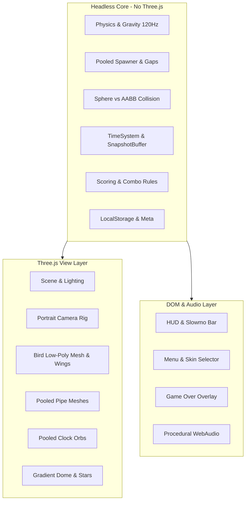

# Flappy3D 🪶⏳

> A mobile-first portrait 3D arcade flyer with 4D time-manipulation mechanics, procedural WebAudio SFX, and stylized realism.


## ✨ Features

- **4D Time Manipulation**:
  - **Bullet-Time Clock Orbs**: Pick up glowing temporal orbs to ease the universe into slow-mo ($0.35\times$) for 3 real seconds while retaining snappy flight control.
  - **Death Rewind Buffer**: 180-tick ($1.5\text{s}$ at $120\text{Hz}$) continuous snapshot ring-buffer. Spend an earned feather $\🪶$ on crash to reverse time and resume with 1 second of invulnerability.
- **Juicy Arcade Addiction Loop**:
  - **Combo Escalator**: Multiplier ramps up to $5\times$ with consecutive passes; near-misses ($<0.3\text{m}$) accelerate combos and trigger micro-flashes.
  - **Milestone Rewards**: Confetti bursts, camera FOV kicks, and celebratory arpeggios every 10 points.
  - **Feather Banking**: Earn feathers on score milestones, bank up to 9 feathers across runs.
- **Atmospheric Stylized Realism**:
  - Continuous 80-point Day/Night cycle sweeping dawn $\rightarrow$ noon $\rightarrow$ dusk $\rightarrow$ starry night with dynamic shadows and sky dome vertex gradient.
  - Low-poly animated bird with dynamic wing springs, pitch dive smoothing, and invulnerability shimmer.
- **Meta Progression & Offline Persistence**:
  - **Daily Streaks**: Automatic local streak tracking.
  - **Skin Unlocks**: Unlock **Sunrise** (15 pts), **Ember** (30 pts), and **Void** (50 pts) skins.
- **100% Procedural Audio**:
  - Zero audio downloads. Real-time synthesized wing flaps, pitch-escalating score chords, collect arpeggios, death crunch, and reverse-swept rewind whooshes via WebAudio API.
- **Mobile PWA First**:
  - Touch-action tuned, zero-delay pointerdown taps, safe-area inset support, and installable PWA manifest.

---

## 🛠️ Architecture



---

## 🚀 Quick Start

### Development
```bash
npm install
npm run dev
```
Open `http://localhost:3000` in your browser.

### Run Tests
```bash
npm test
```

### Production Build
```bash
npm run build
```

---

## 🎮 Controls

- **Tap Screen / Click**: Flap & fly / UI interaction
- **Spacebar**: Flap & fly (Desktop)
- **Audio Toggle**: Mute/unmute button on top right of main menu
