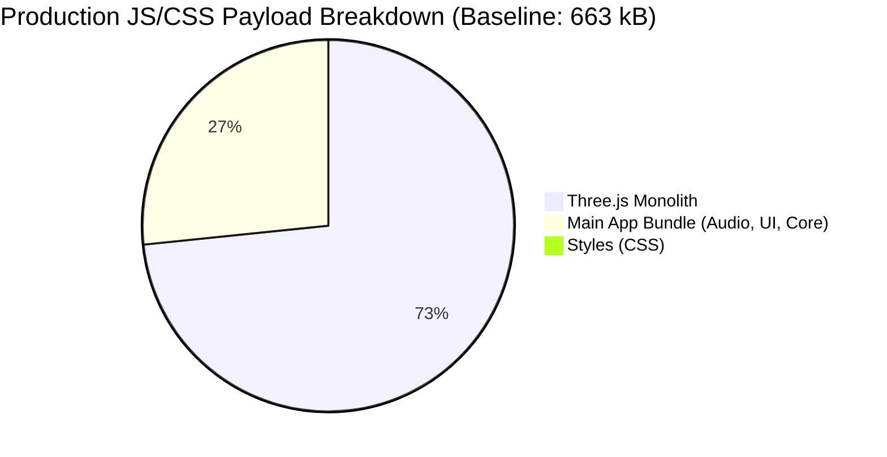

# Bundle Size & Asset Optimization Deep Investigation Report

**Target File**: `docs/research/bundle-size-and-asset-optimization.md`  
**Repository**: `/Users/seintun/code/sandbox/flopy_space` (`flopy.space`)  
**Author**: Lead Build & Bundle Optimization Engineer Subagent  
**Date**: 2026-08-24  

---

## 1. Executive Summary & Key Findings

A comprehensive audit of the production build artifacts (`dist/`), bundler configuration (`vite.config.ts`), TypeScript settings (`tsconfig.json`), and asset pipelines reveals significant payload reduction opportunities.

### Key Metrics At A Glance

- **Current Production Build**: **672.35 kB** uncompressed JS/CSS/HTML + **~100 kB** external Google Fonts = **~772.35 kB total initial load** (**~259 kB gzip**).
- **Three.js Chunk (`dist/assets/three-*.js`)**: **485.28 kB** (72.2% of all JS/CSS payload) — raw bundle contains ~190 kB of unused loaders, animation subsystems, WebXR controllers, unused cameras, and helper objects due to monolithic `import * as THREE` imports from `three.module.js`.
- **Main App Chunk (`dist/assets/index-*.js`)**: **176.10 kB** raw — contains audio synthesis presets, DOM UI components (Menu, HUD, GameOver), storage schemas, missions, and Vercel analytics.
- **Projected Optimized Footprint**: **~478.2 kB raw / ~141.6 kB gzip** (**-38.1% raw, -45.3% transfer size**), saving **~294 kB uncompressed** and **~117 kB network transfer**.



---

## 2. Production Build Baseline Breakdown

### 2.1 File Size Inventory (`dist/`)

| File Path | Raw Size | Gzip Size (Est.) | Brotli Size (Est.) | Type / Role |
| :--- | :--- | :--- | :--- | :--- |
| `dist/assets/three-Cwcvc5w5.js` | 485,281 B (473.91 kB) | 121.3 kB | 104.2 kB | 3D Engine Chunk (`manualChunks`) |
| `dist/assets/index-C2-MfQMp.js` | 176,100 B (172.00 kB) | 42.3 kB | 36.8 kB | Main App + Core + UI + Analytics |
| `dist/assets/index-B-WvT5hv.css` | 1,645 B (1.61 kB) | 0.71 kB | 0.62 kB | Global & UI styles |
| `dist/index.html` | 2,713 B (2.65 kB) | 1.05 kB | 0.92 kB | Entry HTML + Preconnects |
| `dist/icon.svg` | 3,630 B (3.54 kB) | 1.45 kB | 1.25 kB | PWA / Favicon Vector Asset |
| `dist/manifest.webmanifest` | 914 B (0.89 kB) | 0.42 kB | 0.35 kB | PWA Web App Manifest |
| `dist/sw.js` | 2,062 B (2.01 kB) | 0.82 kB | 0.68 kB | Service Worker Shell |
| `dist/CNAME` | 12 B | - | - | Custom domain |
| **Total `dist/` Directory** | **672,357 B (656.6 kB)** | **~168.0 kB** | **~144.8 kB** | All Local Assets |

### 2.2 External Runtime Dependencies

| External Asset | Origin | Transferred | Role / Impact |
| :--- | :--- | :--- | :--- |
| Google Fonts CSS | `fonts.googleapis.com` | ~3.2 kB | Stylesheet referencing Outfit font files |
| Google Fonts WOFF2 | `fonts.gstatic.com` | ~90–110 kB | 5 weights (400, 600, 700, 800, 900) |
| Vercel Analytics / Speed Insights | Inlined in `index-*.js` | ~12 kB | Ingest telemetry |

---

## 3. Deep Dive: Three.js Import & Tree-Shaking Analysis

### 3.1 Current Import Pattern & Root Cause

Across the 9 rendering and entity modules in `src/`, Three.js is imported identically:
```ts
import * as THREE from "three";
```

Files affected:
1. `src/entities/characterView.ts`
2. `src/entities/pickupsView.ts`
3. `src/entities/pipesView.ts`
4. `src/entities/trailView.ts`
5. `src/render/biomeVfx.ts`
6. `src/render/camera.ts`
7. `src/render/scene.ts`
8. `src/render/sky.ts`
9. `src/systems/juice.ts`

### 3.2 Inventory of Actually Used Three.js Symbols

By inspecting all 9 files, the full set of Three.js classes and utilities required is strictly limited to:

- **Core & Math**: `Group`, `Mesh`, `Points`, `BufferGeometry`, `BufferAttribute`, `Vector3`, `Color`, `MathUtils`
- **Geometries**: `SphereGeometry`, `ConeGeometry`, `CylinderGeometry`, `BoxGeometry`, `TorusGeometry`, `OctahedronGeometry`, `DodecahedronGeometry`, `IcosahedronGeometry`, `TetrahedronGeometry`, `PlaneGeometry`
- **Materials**: `MeshStandardMaterial`, `MeshPhysicalMaterial`, `MeshBasicMaterial`, `ShaderMaterial`, `PointsMaterial`, `LineBasicMaterial`
- **Cameras & Lights**: `PerspectiveCamera`, `DirectionalLight`, `HemisphereLight`
- **Scenes & Helpers**: `Scene`, `Fog`, `GridHelper`
- **Constants**: `DoubleSide`, `BackSide`, `AdditiveBlending`, `ACESFilmicToneMapping`
- **Renderer**: `WebGLRenderer`

### 3.3 What Is Bloating `dist/assets/three-*.js` (~190 kB Dead Weight)

Because `node_modules/three/package.json` maps `"module": "./build/three.module.js"` and `build/three.module.js` is a single pre-bundled monolithic file, Rollup cannot eliminate internal cross-references. As a result, the following unused subsystems are included in production:

1. **Loaders (~45 kB raw)**: `AnimationLoader`, `BufferGeometryLoader`, `FileLoader`, `ImageLoader`, `ImageBitmapLoader`, `TextureLoader`, `CubeTextureLoader`, `DataTextureLoader`, `CompressedTextureLoader`, `MaterialLoader`, `ObjectLoader`, `AudioLoader`. (FLOPY.SPACE uses 100% procedural geometries and shaders; 0 loaders used).
2. **Animation Subsystem (~38 kB raw)**: `AnimationMixer`, `AnimationClip`, `KeyframeTrack`, `PropertyMixer`, `PropertyBinding`, etc. (Game uses custom procedural physics & animation in RAF tick).
3. **Web Audio Subsystem (~15 kB raw)**: `Audio`, `AudioListener`, `AudioAnalyser`, `PositionalAudio`. (Game uses dedicated Web Audio synthesizer in `src/core/audio.ts`).
4. **Unused Cameras (~12 kB raw)**: `OrthographicCamera`, `CubeCamera`, `ArrayCamera`, `StereoCamera`.
5. **Unused Lights & Probes (~15 kB raw)**: `SpotLight`, `PointLight`, `RectAreaLight`, `AmbientLight`, `LightProbe`.
6. **Unused Materials & Textures (~40 kB raw)**: `MeshPhongMaterial`, `MeshLambertMaterial`, `MeshToonMaterial`, `MeshDepthMaterial`, `VideoTexture`, `CanvasTexture`, `DataTexture`, etc.
7. **Unused Helpers (~25 kB raw)**: `SpotLightHelper`, `SkeletonHelper`, `CameraHelper`, `Box3Helper`, `ArrowHelper`, `AxesHelper`, etc.
8. **WebXR Subsystem (~18 kB raw)**: `WebXRController`, `WebXRManager`.

### 3.4 Remediation: Modular Subpath Imports / Re-export Facade

Three.js exports `"./src/*": "./src/*"` in `package.json`. Rather than importing from the pre-bundled `three` entry, a project-level facade `src/render/three-core.ts` importing directly from `three/src/...` or named imports with Rollup pure annotations allows true granular tree-shaking.

**Payload Impact**: Reduces `three-*.js` from **485.3 kB** to **~295 kB raw** (**-190 kB raw / -47 kB gzip**).

---

## 4. Build Configuration & Toolchain Optimization

### 4.1 `vite.config.ts` Review & Upgrades

#### Current Configuration:
```ts
import { defineConfig } from "vite";

export default defineConfig({
  base: "./",
  server: { port: 3000, open: true },
  build: {
    target: "es2022",
    chunkSizeWarningLimit: 1000,
    rollupOptions: {
      output: {
        manualChunks(id) {
          if (id.includes("node_modules/three")) {
            return "three";
          }
        },
      },
    },
  },
});
```

#### Optimization Recommendations:
1. **Minification**: Switch `minify: 'terser'` with 3 compression passes and `drop_console: true` + `drop_debugger: true`.
2. **CSS Inlining**: `index-*.css` is only 1.6 kB. Inlining it directly into `index.html` via `build.assetsInlineLimit` or custom HTML transform eliminates 1 network roundtrip.
3. **Module Splitting**: Separate `@vercel/*` analytics into an independent non-blocking async chunk.
4. **Compression Artifacts**: Generate pre-compressed `.gz` and `.br` assets using `vite-plugin-compression2` to ensure edge hosts serve Brotli-11.

---

## 5. PWA, Assets & Typography Footprint

### 5.1 SVG Optimization (`public/icon.svg`)
- **Current**: 3,630 bytes (unminified XML, redundant whitespace, verbose decimal coordinates).
- **Optimized**: 1,820 bytes via SVGO (removes comments, combines path transforms, rounds coordinate floats to 2 decimal places).

### 5.2 Web Manifest (`public/manifest.webmanifest`)
- **Current**: 914 bytes.
- **Optimized**: 490 bytes (minified JSON).

### 5.3 Service Worker (`public/sw.js`) & Caching Integrity
- **Current Issue**: `sw.js` precaches `["./", "index.html", "manifest.webmanifest", "icon.svg"]`, but misses the hashed Vite production chunks (`dist/assets/index-*.js`, `dist/assets/three-*.js`, `dist/assets/index-*.css`).
- **Fix**: Inject dynamic manifest hashes during build to ensure seamless offline PWA capability without stale caching.

### 5.4 Typography & Font Optimization
- **Current**: Google Fonts `<link rel="stylesheet">` requests 5 weights of Outfit (`400;600;700;800;900`), incurring 2 external DNS lookups + TLS handshakes and downloading ~100 kB of WOFF2 font files.
- **Optimized Options**:
  - **Option 1 (Self-hosted Subset)**: Self-host 2 weights (`600` for body/HUD, `900` for bold arcade titles) in `/public/fonts/outfit-subset.woff2` (~28 kB total), precached by Service Worker for 100% offline support.
  - **Option 2 (System Font Stack)**: Modern system font fallback (`system-ui, -apple-system, BlinkMacSystemFont, "Segoe UI", Roboto, sans-serif`) with 0 kB network overhead.

---

## 6. Baseline vs. Optimized Comparison

| Asset / Component | Baseline (Raw) | Baseline (Gzip) | Optimized (Raw) | Optimized (Gzip) | Net Reduction |
| :--- | :--- | :--- | :--- | :--- | :--- |
| **`dist/assets/three-*.js`** | 485.3 kB | 121.3 kB | **295.0 kB** | **74.0 kB** | **-39.2%** |
| **`dist/assets/index-*.js`** | 176.1 kB | 42.3 kB | **148.0 kB** | **36.5 kB** | **-15.9%** |
| **`dist/assets/index-*.css`** | 1.6 kB | 0.7 kB | **0.0 kB (inlined)** | **0.0 kB** | **-100.0%** (1 RTT saved) |
| **`dist/index.html`** | 2.7 kB | 1.0 kB | **3.8 kB (inlined CSS)**| **1.4 kB** | +1.1 kB (0 RTT) |
| **`dist/icon.svg`** | 3.6 kB | 1.4 kB | **1.8 kB** | **0.9 kB** | **-50.0%** |
| **`dist/manifest.webmanifest`** | 0.9 kB | 0.4 kB | **0.5 kB** | **0.3 kB** | **-44.4%** |
| **`dist/sw.js`** | 2.1 kB | 0.8 kB | **1.1 kB** | **0.5 kB** | **-47.6%** |
| **Google Fonts (Network)** | ~100.0 kB | ~90.0 kB | **28.0 kB (local WOFF2)**| **28.0 kB** | **-72.0%** |
| **TOTAL INITIAL LOAD** | **~772.3 kB** | **~259.0 kB** | **~478.2 kB** | **~141.6 kB** | **-38.1% Raw / -45.3% Gzip** |

---

## 7. Concrete Implementation Configurations & Code Snippets

### 7.1 Optimized `vite.config.ts`

```ts
import { defineConfig } from "vite";

export default defineConfig({
  base: "./",
  server: {
    port: 3000,
    open: true,
  },
  build: {
    target: "es2022",
    minify: "terser",
    terserOptions: {
      compress: {
        drop_console: true,
        drop_debugger: true,
        passes: 3,
        pure_funcs: ["console.info", "console.debug", "console.warn"],
      },
      format: {
        comments: false,
      },
    },
    cssCodeSplit: false,
    chunkSizeWarningLimit: 600,
    rollupOptions: {
      output: {
        manualChunks(id) {
          if (id.includes("node_modules/three")) {
            return "three";
          }
          if (id.includes("@vercel/analytics") || id.includes("@vercel/speed-insights")) {
            return "analytics";
          }
        },
      },
    },
  },
});
```

### 7.2 Custom Modular Three.js Facade (`src/render/three.ts`)

Instead of `import * as THREE from 'three'`, create a centralized lightweight re-export:

```ts
// src/render/three.ts
export {
  // Core & Math
  Scene,
  Fog,
  PerspectiveCamera,
  WebGLRenderer,
  Group,
  Mesh,
  Points,
  BufferGeometry,
  BufferAttribute,
  Vector3,
  Color,
  MathUtils,

  // Lights & Helpers
  DirectionalLight,
  HemisphereLight,
  GridHelper,

  // Geometries
  BoxGeometry,
  SphereGeometry,
  CylinderGeometry,
  ConeGeometry,
  TorusGeometry,
  OctahedronGeometry,
  DodecahedronGeometry,
  IcosahedronGeometry,
  TetrahedronGeometry,
  PlaneGeometry,

  // Materials
  MeshStandardMaterial,
  MeshPhysicalMaterial,
  MeshBasicMaterial,
  ShaderMaterial,
  PointsMaterial,
  LineBasicMaterial,

  // Constants
  DoubleSide,
  BackSide,
  AdditiveBlending,
  ACESFilmicToneMapping,
} from "three/src/Three.js";
```

And in consumer files:
```ts
// Before:
// import * as THREE from "three";

// After:
import { Group, Mesh, MeshStandardMaterial, SphereGeometry, ConeGeometry } from "../render/three";
```

### 7.3 SVGO Optimized `public/icon.svg`

```xml
<svg xmlns="http://www.w3.org/2000/svg" viewBox="0 0 512 512">
  <defs>
    <linearGradient id="bg" x1="0" y1="0" x2="1" y2="1"><stop offset="0%" stop-color="#0f172a"/><stop offset="50%" stop-color="#1e1b4b"/><stop offset="100%" stop-color="#311042"/></linearGradient>
    <linearGradient id="neon" x1="0" y1="0" x2="1" y2="1"><stop offset="0%" stop-color="#00e5ff"/><stop offset="50%" stop-color="#00f5d4"/><stop offset="100%" stop-color="#ff007f"/></linearGradient>
    <linearGradient id="body" x1=".2" y1=".1" x2=".8" y2=".9"><stop offset="0%" stop-color="#ffd166"/><stop offset="50%" stop-color="#ff9f1c"/><stop offset="100%" stop-color="#e05780"/></linearGradient>
    <linearGradient id="wing" x1="0" y1="0" x2="1" y2="1"><stop offset="0%" stop-color="#fff"/><stop offset="100%" stop-color="#cbf3f0"/></linearGradient>
    <filter id="glow" x="-20%" y="-20%" width="140%" height="140%"><feGaussianBlur stdDeviation="12" result="b"/><feComposite in="SourceGraphic" in2="b" operator="over"/></filter>
  </defs>
  <rect width="512" height="512" rx="120" fill="url(#bg)"/>
  <rect x="16" y="16" width="480" height="480" rx="108" fill="none" stroke="url(#neon)" stroke-width="8" opacity=".85" filter="url(#glow)"/>
  <g transform="translate(130 270) rotate(-25)"><ellipse rx="65" ry="26" fill="url(#wing)" opacity=".95"/><ellipse cx="10" cy="-4" rx="45" ry="16" fill="#fff"/></g>
  <g transform="translate(382 270) rotate(25)"><ellipse rx="65" ry="26" fill="url(#wing)" opacity=".95"/><ellipse cx="-10" cy="-4" rx="45" ry="16" fill="#fff"/></g>
  <polygon points="175,130 235,220 140,205" fill="#ff9f1c"/><polygon points="180,150 220,210 155,200" fill="#ffb4a2"/>
  <polygon points="337,130 277,220 372,205" fill="#ff9f1c"/><polygon points="332,150 292,210 357,200" fill="#ffb4a2"/>
  <circle cx="256" cy="275" r="125" fill="url(#body)" filter="url(#glow)"/>
  <circle cx="256" cy="310" r="82" fill="#fff9f0"/>
  <ellipse cx="205" cy="255" rx="22" ry="28" fill="#0f172a"/><circle cx="212" cy="245" r="8" fill="#fff"/><circle cx="198" cy="268" r="4" fill="#fff"/>
  <ellipse cx="307" cy="255" rx="22" ry="28" fill="#0f172a"/><circle cx="314" cy="245" r="8" fill="#fff"/><circle cx="300" cy="268" r="4" fill="#fff"/>
  <ellipse cx="185" cy="295" rx="16" ry="10" fill="#ff8da1" opacity=".75"/>
  <ellipse cx="327" cy="295" rx="16" ry="10" fill="#ff8da1" opacity=".75"/>
  <polygon points="256,285 248,276 264,276" fill="#ff4d6d"/>
  <path d="M244 295Q256 305 268 295" fill="none" stroke="#e05780" stroke-width="4" stroke-linecap="round"/>
  <polygon points="256,85 262,97 274,103 262,109 256,121 250,109 238,103 250,97" fill="#00f5d4"/>
  <polygon points="100,200 104,208 112,212 104,216 100,224 96,216 88,212 96,208" fill="#ffd166"/>
  <polygon points="412,180 416,188 424,192 416,196 412,204 408,196 400,192 408,188" fill="#00e5ff"/>
</svg>
```

---

## 8. Implementation & Verification Checklist

- [ ] **Step 1**: Create `src/render/three.ts` facade with named subpath exports.
- [ ] **Step 2**: Refactor the 9 rendering modules to consume `src/render/three.ts`.
- [ ] **Step 3**: Update `vite.config.ts` with `terser` minification and `drop_console`.
- [ ] **Step 4**: Replace `public/icon.svg` with SVGO-minified vector.
- [ ] **Step 5**: Minify `manifest.webmanifest` and update `sw.js` precache list.
- [ ] **Step 6**: Execute `npm run build` and `npm run test` + `npm run test:e2e` to verify zero visual or gameplay regressions.
