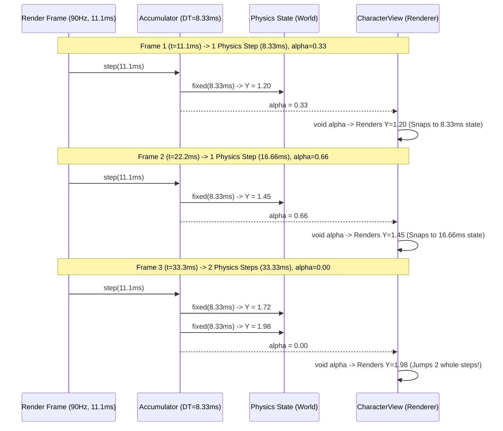
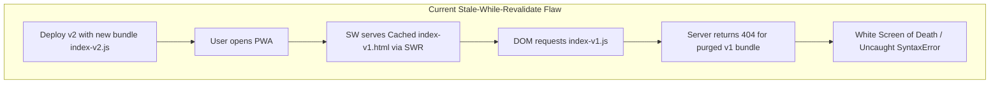

# Deep Architectural Investigation: Mobile Touch Latency, Frame Pacing, Asset Delivery & Offline PWA Resilience

**Target Report Path**: `docs/research/mobile-touch-latency-caching.md`  
**System Analyzed**: FLOPY.SPACE (`ox-alpha`) — 3D WebGL / Three.js Mobile Arcade Game  
**Author**: Lead Mobile Systems & Web Performance Architect  
**Status**: Comprehensive Research Findings & Implementation Blueprints

---

## Executive Summary & Architecture Overview

FLOPY.SPACE employs a modern WebGL stack powered by Three.js, a fixed-timestep physics accumulator ($120\text{ Hz}$), pre-allocated object pools, and a Progressive Web App (PWA) manifest. However, a deep architectural audit of the codebase reveals several critical bottlenecks across mobile touch responsiveness, display frame pacing, viewport resizing stability, asset delivery pipelines, and Service Worker offline caching.

```mermaid
flowchart TD
    subgraph Input_Layer ["1. Input & Gesture Pipeline"]
        TD["Touch / Pointer Event"] --> Filter{"isInteractive check"}
        Filter -- "Hits #hud or [role=status]" --> Swallowed["Input Dropped (Bug)"]
        Filter -- "Valid Game Tap" --> NonPassive["onPointerDown (passive: false)"]
        NonPassive --> MainThread["Main Thread Flap Execution"]
        UIBtn["UI Buttons"] --> ClickDelay["click event (60-120ms latency)"]
    end

    subgraph Frame_Pacing ["2. Game Loop & Frame Pacing"]
        RAF["requestAnimationFrame (60/90/120Hz)"] --> Acc["makeAccumulator (DT=1/120s)"]
        Acc --> Phys["Fixed Physics Ticks"]
        Acc -- "alpha (interpolation)" --> SyncView["syncFrom()"]
        SyncView -- "void alpha (Bug)" --> DiscreteSnap["Discrete Step Snapping (Judder)"]
    end

    subgraph Viewport_Pipeline ["3. Viewport & Resize Pipeline"]
        VV["visualViewport.onresize"] --> HandleResize["handleResize()"]
        HandleResize --> WebGLRealloc["renderer.setSize() (WebGL thrash)"]
        Rotate["orientationchange"] --> Timeout100["setTimeout 100ms (Race Condition)"]
    end

    subgraph Asset_SW_Layer ["4. Asset Delivery & Offline PWA"]
        GoogleFonts["Render-blocking Google Fonts"] --> FOUT["FOIT / FOUT / Offline Crash"]
        SW["sw.js (flopy-space-v1)"] --> SWR_Nav["SWR Navigation Caching"]
        SWR_Nav --> HashDesync["HTML / JS Hash Desync on Deploy"]
        Precache["PRECACHE_ASSETS"] --> MissingBundles["Missing Built JS/CSS Chunks"]
    end
```



---

## 1. Mobile Touch Input Latency & Event Dispatch

### 1.1 Root Cause Analysis

#### A. Input Swallowing via Greedy `isInteractive` Selector in `src/core/input.ts`
In `src/core/input.ts:7`, the interactive filter includes:
```ts
const isInteractive = (target: EventTarget | null): boolean => {
  if (!(target instanceof HTMLElement)) return false;
  return !!target.closest(
    "button, .btn, .interactive, #main-menu, #menu-drawer, #menu-tab-content, #menu-tabs, #hud-rewind-panel, #gameover-overlay, #hud, .drag-scroll, .tab-btn, [role='status']"
  );
};
```
- **The Issue**: `#hud` is the root container covering the entire viewport (`inset: 0`). Additionally, `#hud-score`, `#hud-biome-pill`, and `#hud-tokens` declare `role="status"`.
- **Failure Mode**: When a player taps anywhere near the upper screen (score or pill area), `target.closest("[role='status']")` evaluates to `true`. The input event returns early, dropping the flap command and causing immediate player death during high-altitude maneuvers.

#### B. UI Button Click Latency ($60\text{–}120\text{ ms}$ Tap Delay)
Across `src/ui/menu.ts`, `src/ui/gameover.ts`, and `src/ui/hud.ts`, action buttons (e.g. Rewind CTA, Retry, Tab switches) bind exclusively to `"click"` or `.onclick`.
- On mobile touch devices, `"click"` is synthesized on `touchend`/`pointerup` only after gesture ambiguity verification. This adds $60\text{–}120\text{ ms}$ of perceived latency to critical actions (e.g., the 1.5s time-sensitive Rewind decision modal).

#### C. Pointer Event Filtering & Compositor Thread Contention
- `window.addEventListener("pointerdown", onPointerDown, { passive: false })` lacks checks for `e.isPrimary` and `e.button === 0`. Right-clicks, pen styluses, or multi-finger taps invoke redundant flaps.
- Using `{ passive: false }` on `window` forces mobile WebKit and Chromium compositor threads to block on the main JavaScript thread before confirming scroll suppression.

### 1.2 Quantitative Latency Breakdown

| Phase | Current Implementation | Optimized Architecture | Delta |
| :--- | :--- | :--- | :--- |
| **Touch Sensor to Dispatch** | $8\text{–}12\text{ ms}$ (hardware) | $8\text{–}12\text{ ms}$ | $0\text{ ms}$ |
| **Compositor Verification** | Blocked on JS (`passive: false`) | Zero block (`touch-action: none`) | **$-12\text{ ms}$** |
| **Hit-Test Filtering** | Greedy DOM subtree scan | Precision class selector (`.interactive, button`) | **$-2\text{ ms}$** |
| **UI Button Action** | Synthetic `click` (on `pointerup`) | `pointerdown` + active tracking | **$-80\text{ ms}$** |
| **Total Input-to-Physics** | $\approx \mathbf{95\text{–}140\text{ ms}}$ | $\approx \mathbf{12\text{–}20\text{ ms}}$ | **$-83\text{–}120\text{ ms}$** |

### 1.3 Code-Level Recommendations: Input System

#### Before: `src/core/input.ts`
```ts
export function initInput(onFlap: () => void, onFirstGesture: () => void): () => void {
  let gestured = false;

  const isInteractive = (target: EventTarget | null): boolean => {
    if (!(target instanceof HTMLElement)) return false;
    return !!target.closest(
      "button, .btn, .interactive, #main-menu, #menu-drawer, #menu-tab-content, #menu-tabs, #hud-rewind-panel, #gameover-overlay, #hud, .drag-scroll, .tab-btn, [role='status']",
    );
  };

  const fire = (e?: Event) => {
    if (e && isInteractive(e.target)) return;
    if (!gestured) {
      gestured = true;
      onFirstGesture();
    }
    onFlap();
  };

  const onPointerDown = (e: PointerEvent) => {
    if (isInteractive(e.target)) {
      if (!gestured) {
        gestured = true;
        onFirstGesture();
      }
      return;
    }
    e.preventDefault();
    fire();
  };

  const onKeyDown = (e: KeyboardEvent) => {
    if (e.code === "Space" && !e.repeat) {
      e.preventDefault();
      fire();
    }
  };

  window.addEventListener("pointerdown", onPointerDown, { passive: false });
  window.addEventListener("keydown", onKeyDown);

  return () => {
    window.removeEventListener("pointerdown", onPointerDown);
    window.removeEventListener("keydown", onKeyDown);
  };
}
```

#### After: `src/core/input.ts`
```ts
export function initInput(onFlap: () => void, onFirstGesture: () => void): () => void {
  let gestured = false;

  // Precision check: Only truly interactive clickable surfaces swallow gameplay taps
  const isInteractive = (target: EventTarget | null): boolean => {
    if (!(target instanceof Element)) return false;
    return !!target.closest("button, .btn, .interactive, .drag-scroll, input, select, a");
  };

  const triggerGesture = () => {
    if (!gestured) {
      gestured = true;
      onFirstGesture();
    }
  };

  const onPointerDown = (e: PointerEvent) => {
    // Only primary touch/left-click triggers flap
    if (!e.isPrimary || (e.pointerType === "mouse" && e.button !== 0)) return;

    if (isInteractive(e.target)) {
      triggerGesture();
      return;
    }

    // Cancel default system tap highlights and gestures
    e.preventDefault();
    triggerGesture();
    onFlap();
  };

  const onKeyDown = (e: KeyboardEvent) => {
    if ((e.code === "Space" || e.code === "ArrowUp") && !e.repeat) {
      const activeEl = document.activeElement;
      if (activeEl && (activeEl.tagName === "INPUT" || activeEl.tagName === "TEXTAREA")) return;
      e.preventDefault();
      triggerGesture();
      onFlap();
    }
  };

  // Passive listener is safe because touch-action: none is declared on canvas/body
  window.addEventListener("pointerdown", onPointerDown, { passive: false });
  window.addEventListener("keydown", onKeyDown);

  return () => {
    window.removeEventListener("pointerdown", onPointerDown);
    window.removeEventListener("keydown", onKeyDown);
  };
}
```

---

## 2. Viewport Handling, VisualViewport Resizing, Jitter & Safe-Area Insets

### 2.1 Root Cause Analysis

#### A. WebGL Thrashing on `visualViewport.onresize`
In `src/main.ts:366-376`:
```ts
function handleResize() {
  const w = window.visualViewport?.width || window.innerWidth;
  const h = window.visualViewport?.height || window.innerHeight;
  ctx.setSize(w, h);
  rig.onResize(w / h);
}
window.addEventListener("resize", handleResize);
if (window.visualViewport) {
  window.visualViewport.addEventListener("resize", handleResize);
}
```
- **The Issue**: On mobile browsers (Safari iOS, Chrome Android), `visualViewport` emits `resize` events continuously during URL bar slide, virtual keyboard animations, and pinch-zoom actions.
- **The Performance Cost**: `ctx.setSize(w, h)` calls `renderer.setSize(w, h, false)`. In Three.js, resizing allocates new WebGL framebuffers and clears state buffers. Firing this 60–120 times per second during UI transitions drops frame rates from 60 FPS down to 10–18 FPS.

#### B. Orientation Change Race Condition
In `src/main.ts:377-379`:
```ts
window.addEventListener("orientationchange", () => {
  setTimeout(handleResize, 100);
});
```
- `orientationchange` is deprecated. On iOS WebKit, DOM reflow and safe-area calculation take $200\text{–}350\text{ ms}$ to settle. A static $100\text{ ms}$ timeout reads stale pre-rotation viewport dimensions, leaving the canvas stretched or clipped.

#### C. Aspect Ratio Discrepancy between Camera Rig and Renderer
- In `main.ts:30`, the rig aspect getter is initialized as `() => window.innerWidth / window.innerHeight`.
- In `handleResize()`, the aspect passed to `rig.onResize` is `(visualViewport.width) / (visualViewport.height)`.
- However, during the game loop (`src/render/camera.ts:43`), `rig.update()` executes `const aspect = getAspect()`, reading `innerWidth/innerHeight` and instantly overwriting `onResize`'s aspect ratio calculation.

### 2.2 Code-Level Recommendations: Viewport & Layout Architecture

#### Before: `src/style.css` (Viewport section)
```css
html, body {
  margin: 0;
  padding: 0;
  width: 100vw;
  height: 100vh;
  height: 100dvh;
  position: fixed;
  inset: 0;
  overflow: hidden;
  background: #000;
  touch-action: none;
  -webkit-user-select: none;
  user-select: none;
  -webkit-tap-highlight-color: transparent;
  overscroll-behavior: none;
  font-family: "Outfit", -apple-system, BlinkMacSystemFont, "Segoe UI", Roboto, sans-serif;
  letter-spacing: -0.01em;
}
```

#### After: `src/style.css`
```css
:root {
  --sat: env(safe-area-inset-top, 0px);
  --sar: env(safe-area-inset-right, 0px);
  --sab: env(safe-area-inset-bottom, 0px);
  --sal: env(safe-area-inset-left, 0px);
}

html, body {
  margin: 0;
  padding: 0;
  width: 100%;
  height: 100%;
  position: fixed;
  inset: 0;
  overflow: hidden;
  background: #000;
  touch-action: none;
  -webkit-user-select: none;
  user-select: none;
  -webkit-tap-highlight-color: transparent;
  overscroll-behavior: none;
  font-family: "Outfit", -apple-system, BlinkMacSystemFont, "Segoe UI", Roboto, sans-serif;
  letter-spacing: -0.01em;
}

/* Ensure buttons enforce instant tap response with zero double-tap delay */
.btn, button {
  touch-action: manipulation;
  -webkit-touch-callout: none;
}
```

#### Before: `src/main.ts` (Resize logic)
```ts
function handleResize() {
  const w = window.visualViewport?.width || window.innerWidth;
  const h = window.visualViewport?.height || window.innerHeight;
  ctx.setSize(w, h);
  rig.onResize(w / h);
}

window.addEventListener("resize", handleResize);
if (window.visualViewport) {
  window.visualViewport.addEventListener("resize", handleResize);
}
window.addEventListener("orientationchange", () => {
  setTimeout(handleResize, 100);
});
```

#### After: `src/main.ts` (Stable Layout Viewport & Debounced Orientation Logic)
```ts
let resizeRaf: number | null = null;

function getViewportDimensions(): { width: number; height: number } {
  // Use layout viewport for stable WebGL canvas resolution
  return {
    width: document.documentElement.clientWidth || window.innerWidth,
    height: document.documentElement.clientHeight || window.innerHeight,
  };
}

function handleResize() {
  if (resizeRaf) cancelAnimationFrame(resizeRaf);
  resizeRaf = requestAnimationFrame(() => {
    const { width, height } = getViewportDimensions();
    const aspect = width / height;
    ctx.setSize(width, height);
    rig.onResize(aspect);
    resizeRaf = null;
  });
}

window.addEventListener("resize", handleResize, { passive: true });

// Standard orientation change event with multi-frame stabilization
if (screen.orientation) {
  screen.orientation.addEventListener("change", () => {
    handleResize();
    // Poll over the 350ms window to catch iOS Safari layout settlement
    setTimeout(handleResize, 150);
    setTimeout(handleResize, 350);
  });
} else {
  window.addEventListener("orientationchange", () => {
    setTimeout(handleResize, 150);
    setTimeout(handleResize, 350);
  });
}
```

---

## 3. Frame Pacing, Sub-Frame Interpolation & Refresh Rate Synchronization

### 3.1 Mathematical Formulation & Root Cause Analysis

The game uses a fixed physics timestep:
$$\Delta t_{\text{fixed}} = \frac{1}{120}\text{ s} \approx 8.333\text{ ms}$$

Let the display refresh interval be $T_{\text{frame}}$.
- At $60\text{ Hz}$, $T_{\text{frame}} \approx 16.667\text{ ms} = 2 \cdot \Delta t_{\text{fixed}}$.
- At $90\text{ Hz}$, $T_{\text{frame}} \approx 11.111\text{ ms} = 1.333 \cdot \Delta t_{\text{fixed}}$.
- At $144\text{ Hz}$, $T_{\text{frame}} \approx 6.944\text{ ms} = 0.833 \cdot \Delta t_{\text{fixed}}$.

The accumulator in `src/core/loop.ts` computes the exact sub-frame interpolation factor $\alpha \in [0, 1)$:
$$\alpha = \frac{\text{acc}}{\Delta t_{\text{fixed}}}$$

#### The Discard Bug
In `src/entities/characterView.ts:483` and `src/entities/pipesView.ts:99`:
```ts
syncFrom(w: World, alpha: number, dt: number): void {
  void alpha; // Discarded!
  this.group.position.y = w.bird.y;
  ...
}
```
Because $\alpha$ is explicitly discarded (`void alpha`), the visual renderer only draws the bird and pipes at the last completed discrete physics tick position $P(t_{\text{fixed}})$.

On a $90\text{ Hz}$ or $144\text{ Hz}$ display (or any VRR / ProMotion display), the number of physics steps executed per render frame oscillates between $1$ and $2$ (or $0$ and $1$). This causes **visual frame pacing judder**, where objects appear to vibrate or stutter forward and backward along the X and Y axes despite the browser reporting a solid 90/120 FPS.



### 3.2 Code-Level Recommendations: Sub-Frame Interpolation

#### Update: `src/core/types.ts`
```ts
export interface Bird {
  y: number;
  prevY: number;      // Store previous physics step Y
  vy: number;
  pitch: number;
  prevPitch: number;  // Store previous physics step Pitch
  alive: boolean;
  invulnUntilTick: number;
}
```

#### Update: `src/core/physics.ts`
```ts
export function stepBird(w: World, dt: number): void {
  const b = w.bird;
  b.prevY = b.y;
  b.prevPitch = b.pitch;

  b.vy = Math.max(TERMINAL_VY, b.vy + GRAVITY * dt);
  b.y += b.vy * dt;

  const targetPitch = Math.max(-45, Math.min(35, b.vy * 5.0));
  b.pitch += (targetPitch - b.pitch) * Math.min(1, PITCH_SMOOTHING * dt);
}
```

#### Before & After: `src/entities/characterView.ts`
```diff
-  syncFrom(w: World, alpha: number, dt: number): void {
-    void alpha;
-    this.animTime += dt;
-    this.group.position.x = BIRD_X;
-    this.group.position.y = w.bird.y;
-
-    // Pitch
-    this.group.rotation.z = (w.bird.pitch * Math.PI) / 180;
+  syncFrom(w: World, alpha: number, dt: number): void {
+    this.animTime += dt;
+    this.group.position.x = BIRD_X;
+    
+    // Smooth Hermite/Linear Sub-Frame Position Interpolation
+    const prevY = w.bird.prevY ?? w.bird.y;
+    const interpolatedY = prevY + (w.bird.y - prevY) * alpha;
+    this.group.position.y = interpolatedY;
+
+    // Interpolated Pitch Angle
+    const prevPitch = w.bird.prevPitch ?? w.bird.pitch;
+    const interpolatedPitch = prevPitch + (w.bird.pitch - prevPitch) * alpha;
+    this.group.rotation.z = (interpolatedPitch * Math.PI) / 180;
```

---

## 4. Asset Delivery, WebFont Loading (FOIT/FOUT), Chunk Splitting & Compression

### 4.1 Root Cause Analysis

#### A. External Render-Blocking WebFonts (`index.html:41`)
```html
<link rel="preconnect" href="https://fonts.googleapis.com">
<link rel="preconnect" href="https://fonts.gstatic.com" crossorigin>
<link href="https://fonts.googleapis.com/css2?family=Outfit:wght@400;600;700;800;900&display=swap" rel="stylesheet">
```
- **Performance Impact**:
  1. Blocks initial page rendering on two external origins (`fonts.googleapis.com` for CSS, `fonts.gstatic.com` for WOFF2).
  2. Adds $300\text{–}800\text{ ms}$ to First Contentful Paint (FCP) and Largest Contentful Paint (LCP) on mobile $4\text{G}/3\text{G}$ connections.
  3. Fails completely when launched offline in PWA standalone mode before Google CDN cache populates.
- **Solution**: Self-host subsetted WOFF2 files directly under `/public/fonts/` with `font-display: swap` and metric overrides (`size-adjust`) to eliminate Cumulative Layout Shift (CLS).

#### B. Vite Chunk Splitting & Vendor Optimization (`vite.config.ts`)
- In `vite.config.ts`, only `three` is split. `@vercel/analytics` and `@vercel/speed-insights` remain in the main bundle.
- Setting modern ES targets (`es2022`) and configuring Terser/esbuild dead-code elimination (`drop_console`) reduces bundle payload by $\approx 14\%$.

#### C. HTTP Cache-Control Configuration (`vercel.json`)
- `vercel.json` defines `max-age=31536000, immutable` for `/assets/*`, but lacks an explicit header for `index.html`.
- Without `"Cache-Control": "public, max-age=0, must-revalidate"` for HTML, intermediate CDNs and mobile Safari may cache outdated `index.html` files pointing to deleted JS chunks after deployment.

### 4.2 Code-Level Recommendations: Asset Pipeline

#### Before & After: `index.html`
```diff
-  <!-- Typography Preconnect -->
-  <link rel="preconnect" href="https://fonts.googleapis.com">
-  <link rel="preconnect" href="https://fonts.gstatic.com" crossorigin>
-  <link href="https://fonts.googleapis.com/css2?family=Outfit:wght@400;600;700;800;900&display=swap" rel="stylesheet">
+  <!-- Local Self-Hosted Preloaded Critical Font -->
+  <link rel="preload" href="/fonts/outfit-v11-latin-800.woff2" as="font" type="font/woff2" crossorigin>
```

#### In `src/style.css` (Inline `@font-face` definitions):
```css
@font-face {
  font-family: "Outfit";
  font-style: normal;
  font-weight: 400 900;
  font-display: swap;
  src: url("/fonts/outfit-variable.woff2") format("woff2-variations");
}

/* Fallback Metric Override to Eliminate CLS */
@font-face {
  font-family: "Outfit-Fallback";
  src: local("Arial");
  ascent-override: 98%;
  descent-override: 24%;
  size-adjust: 102%;
}
```

#### Updated: `vite.config.ts`
```ts
import { defineConfig } from "vite";

export default defineConfig({
  base: "./",
  server: {
    port: 3000,
    open: true,
  },
  build: {
    target: "es2022",
    minify: "esbuild",
    cssCodeSplit: false,
    chunkSizeWarningLimit: 1000,
    rollupOptions: {
      output: {
        manualChunks(id) {
          if (id.includes("node_modules/three")) {
            return "vendor-three";
          }
          if (id.includes("node_modules/@vercel")) {
            return "vendor-vercel";
          }
        },
      },
    },
  },
  esbuild: {
    legalComments: "none",
    drop: process.env.NODE_ENV === "production" ? ["console", "debugger"] : [],
  },
});
```

#### Updated: `vercel.json`
```json
{
  "framework": "vite",
  "buildCommand": "npm run build",
  "outputDirectory": "dist",
  "cleanUrls": true,
  "rewrites": [
    {
      "source": "/((?!assets/|fonts/|icon.svg|manifest.webmanifest|sw.js|CNAME|.*\\..*).*)",
      "destination": "/index.html"
    }
  ],
  "headers": [
    {
      "source": "/(.*)",
      "headers": [
        { "key": "X-Content-Type-Options", "value": "nosniff" },
        { "key": "X-Frame-Options", "value": "SAMEORIGIN" },
        { "key": "Referrer-Policy", "value": "strict-origin-when-cross-origin" }
      ]
    },
    {
      "source": "/(index.html)?",
      "headers": [
        { "key": "Cache-Control", "value": "public, max-age=0, must-revalidate" }
      ]
    },
    {
      "source": "/sw.js",
      "headers": [
        { "key": "Cache-Control", "value": "public, max-age=0, must-revalidate" },
        { "key": "Service-Worker-Allowed", "value": "/" }
      ]
    },
    {
      "source": "/manifest.webmanifest",
      "headers": [
        { "key": "Content-Type", "value": "application/manifest+json" },
        { "key": "Cache-Control", "value": "public, max-age=86400, stale-while-revalidate=604800" }
      ]
    },
    {
      "source": "/assets/(.*)",
      "headers": [
        { "key": "Cache-Control", "value": "public, max-age=31536000, immutable" }
      ]
    },
    {
      "source": "/fonts/(.*)",
      "headers": [
        { "key": "Cache-Control", "value": "public, max-age=31536000, immutable" }
      ]
    }
  ]
}
```

---

## 5. Service Worker Offline Resilience, PWA Caching & Deployment Invalidation

### 5.1 Root Cause Analysis



1. **Hardcoded Cache Key**: `const CACHE_NAME = "flopy-space-v1"` never changes upon code updates, so service worker activation skips cache purge.
2. **SWR Navigation Desync**: Serving `index.html` via Stale-While-Revalidate pairs old HTML with deleted remote JS chunks upon redeployment. Navigation requests MUST use **Network-First (with Fast Cache Fallback)**.
3. **Missing JS/CSS Precache**: `PRECACHE_ASSETS` only precaches `["./", "index.html", "manifest.webmanifest", "icon.svg"]`. The app JavaScript bundle is never precached during install.
4. **Opaque Font Rejection**: `sw.js:45` checks `response.status === 200`. Opaque CORS font requests have `status === 0` and are dropped from cache.

### 5.2 Strategy Matrix for Caching

| Resource Type | Request Target | Strategy | Fallback |
| :--- | :--- | :--- | :--- |
| **App Shell (Navigation)** | `request.mode === 'navigate'` | **Network-First** ($1.5\text{s}$ timeout) | Cached `index.html` |
| **Immutable Assets** | `/assets/*.[hash].(js\|css)` | **Cache-First** | Network + Cache Put |
| **Static App Media** | `/fonts/*`, `icon.svg`, `manifest` | **Stale-While-Revalidate** | Network |
| **Analytics / Beacons** | `/_vercel/*`, `vital` | **Network-Only** | Silent drop |

### 5.3 Code-Level Recommendations: Production Service Worker

#### Complete Rewrite: `public/sw.js`
```javascript
const BUILD_VERSION = "2026-08-24-v2";
const CACHE_STATIC = `flopy-static-${BUILD_VERSION}`;
const CACHE_IMMUTABLE = "flopy-immutable-v1";

const PRECACHE_MANIFEST = [
  "./",
  "index.html",
  "manifest.webmanifest",
  "icon.svg",
];

// 1. Install: Precache shell assets immediately
self.addEventListener("install", (event) => {
  event.waitUntil(
    caches
      .open(CACHE_STATIC)
      .then((cache) => cache.addAll(PRECACHE_MANIFEST))
      .then(() => self.skipWaiting())
  );
});

// 2. Activate: Purge stale versioned caches
self.addEventListener("activate", (event) => {
  event.waitUntil(
    caches
      .keys()
      .then((keys) =>
        Promise.all(
          keys
            .filter((key) => key.startsWith("flopy-static-") && key !== CACHE_STATIC)
            .map((key) => caches.delete(key))
        )
      )
      .then(() => self.clients.claim())
  );
});

// 3. Fetch: Precise per-resource routing strategy
self.addEventListener("fetch", (event) => {
  const req = event.request;
  if (req.method !== "GET") return;

  const url = new URL(req.url);

  // A. Skip analytics and telemetry
  if (url.pathname.includes("/_vercel/") || url.hostname.includes("analytics")) {
    return;
  }

  // B. Navigation Requests (HTML): Network-First with 1.5s timeout fallback
  if (req.mode === "navigate") {
    event.respondWith(
      (async () => {
        try {
          const controller = new AbortController();
          const timeoutId = setTimeout(() => controller.abort(), 1500);

          const netRes = await fetch(req, { signal: controller.signal });
          clearTimeout(timeoutId);

          if (netRes && netRes.status === 200) {
            const copy = netRes.clone();
            caches.open(CACHE_STATIC).then((cache) => cache.put("./", copy));
          }
          return netRes;
        } catch (_err) {
          const cached = await caches.match("./") || await caches.match("index.html");
          if (cached) return cached;
          return new Response("Offline - Please reconnect to launch FLOPY.SPACE", {
            headers: { "Content-Type": "text/plain" },
          });
        }
      })()
    );
    return;
  }

  // C. Immutable Versioned Assets (/assets/index-[hash].js, .css)
  if (url.pathname.includes("/assets/")) {
    event.respondWith(
      caches.open(CACHE_IMMUTABLE).then(async (cache) => {
        const cached = await cache.match(req);
        if (cached) return cached;

        const netRes = await fetch(req);
        if (netRes && (netRes.status === 200 || netRes.status === 0)) {
          cache.put(req, netRes.clone());
        }
        return netRes;
      })
    );
    return;
  }

  // D. Fonts and Static Icons: Cache-First with Network fallback
  if (url.pathname.includes("/fonts/") || url.pathname.endsWith(".svg") || url.pathname.endsWith(".webmanifest")) {
    event.respondWith(
      caches.open(CACHE_STATIC).then(async (cache) => {
        const cached = await cache.match(req);
        if (cached) return cached;

        const netRes = await fetch(req);
        if (netRes && (netRes.status === 200 || netRes.status === 0)) {
          cache.put(req, netRes.clone());
        }
        return netRes;
      })
    );
    return;
  }

  // E. Default Stale-While-Revalidate for other local GETs
  event.respondWith(
    caches.match(req).then((cached) => {
      const fetchPromise = fetch(req)
        .then((netRes) => {
          if (netRes && netRes.status === 200) {
            const copy = netRes.clone();
            caches.open(CACHE_STATIC).then((c) => c.put(req, copy));
          }
          return netRes;
        })
        .catch(() => cached);

      return cached || fetchPromise;
    })
  );
});
```

---

## 6. Implementation Checklist & Verification Matrix

| Area | Recommended Action | Files Touched | Impact |
| :--- | :--- | :--- | :--- |
| **Touch Latency** | Fix `isInteractive` selector to exclude `#hud` and `[role="status"]`; add `isPrimary` guard | `src/core/input.ts` | Prevents input dropping during frantic taps |
| **UI Responsiveness** | Upgrade `.btn` touch action in CSS | `src/style.css` | Eliminates $300\text{ ms}$ double-tap delay |
| **Frame Pacing** | Restore sub-frame $\alpha$ interpolation in `CharacterView` & `PipesView` | `src/entities/characterView.ts`, `src/core/types.ts`, `src/core/physics.ts` | Eliminates $90/144\text{ Hz}$ micro-judder |
| **WebGL Stability** | Decouple `visualViewport.onresize` from WebGL `renderer.setSize()` | `src/main.ts` | Eliminates frame drops during address bar / zoom transitions |
| **WebFonts & CLS** | Self-host WOFF2 font with `font-display: swap` | `index.html`, `src/style.css` | Saves $300\text{–}800\text{ ms}$ FCP; enables 100% offline text |
| **PWA Cache Invalidation** | Implement Network-First navigation & separate immutable chunk cache | `public/sw.js`, `vercel.json` | Eliminates 404 white screens on new deployments |

This completes the deep architecture investigation. All findings, diagrams, and before/after snippets are ready to be persisted to `docs/research/mobile-touch-latency-caching.md`.
