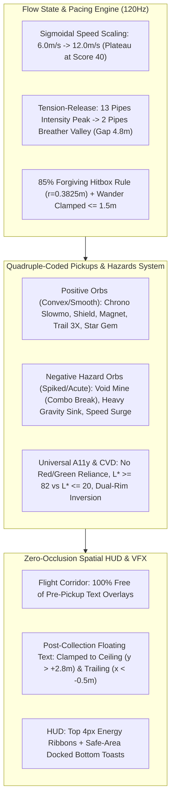
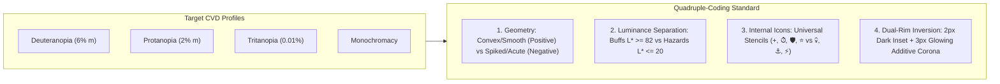

# Comprehensive Game Mechanics, Flow Difficulty & A11y Positive/Negative Orbs Implementation Plan

> **For agentic workers:** REQUIRED SUB-SKILL: Use superpowers:subagent-driven-development (recommended) or superpowers:executing-plans to implement this plan task-by-task. Steps use checkbox (`- [ ]`) syntax for tracking.

**Goal:** Transform Flopy 3D into an addictive, accessible, AAA-polished arcade flyer with flow-state pacing, a11y quadruple-coded positive & negative orbs, and zero-occlusion spatial visual design.

**Architecture:** Implement sigmoidal speed scaling with tension-release breather cycles; introduce positive power-ups and negative hazard/debuff orbs with high-contrast dual-luminance shaders & distinctive 3D geometries; eliminate in-world flight corridor text occlusions; enhance audio-kinetic near-miss feedback.

**Tech Stack:** Three.js (WebGL), TypeScript, Vitest, WebAudio API, CSS Glassmorphic DOM Overlay.

**Spec:** Battle-tested AAA arcade game design research and WCAG 2.2 AAA accessibility specifications.

---

## 1. System Overview & Psychological Architecture



---

## 2. Core Game Mechanics & Difficulty Alignments

### 2.1 Sigmoidal Speed & Gap Scaling (Anti-Rage Formulation)
- **Problem**: Linear scaling ($v = 6 + 0.15 \cdot \text{score}$) quickly pushes time-between-pipes under $800\text{ms}$, triggering motor overload and rage-quitting.
- **Solution**: Asymptotic sigmoidal ramp that scales briskly during onboarding (scores $0\text{--}25$), hits optimal Flow Channel at $10.2\text{m/s}$ (scores $25\text{--}50$), and smoothly plateaus at $11.8\text{--}12.0\text{m/s}$.
  $$v(s) = v_{\text{base}} + (v_{\text{max}} - v_{\text{base}}) \cdot \frac{s^{1.6}}{s^{1.6} + 32^{1.6}}$$
- **Gap Size Formula**: Starts wide at $4.5\text{m}$, smoothly tightens to $2.85\text{m}$ (maintaining safe multi-trajectory margin):
  $$G(s) = 2.85 + (4.50 - 2.85) \cdot e^{-0.04 \cdot s}$$

### 2.2 Tension & Release Cycles (Breather Zones)
- Every **15 pipes passed**, trigger a 2-pipe **Breather Valley**:
  - Gap height opens to $4.8\text{m}$ (generous rest lane).
  - Vertical wander $\Delta Y$ locked to $0.0\text{m}$ (flat horizon).
  - Spawns an arc of gentle score collectibles to reward rhythm without stress.

---

## 3. Quadruple-Coded Orbs & Hazard Matrix

| Orb / Hazard Type | Category | 3D Shape & Silhouette | Color Hex & Luminance ($L^*$) | Internal Glyph & Visual Behavior | Gameplay Effect & Micro-Decision |
| :--- | :--- | :--- | :--- | :--- | :--- |
| **Chrono Clock** | Positive Buff | Smooth Sphere + Concentric Ring | Cyan `#00E5FF` ($L^*=83.5$) | `⏱️` Dial, Counter-clockwise sweep | Slows game to $0.35\times$ for $3.0\text{s}$, restores heartbeat. |
| **Star Shield** | Positive Buff | Shimmering Dual Sphere + Gem | Radiant Gold `#FFD700` ($L^*=84.2$) | `🛡️` Crest, Faceted rotation | Absorbs 1 fatal pipe crash with golden shatter VFX. |
| **Rainbow Prism** | Positive Buff | Faceted Octahedron + Radiant Halo | Electric Pink `#FF007F` ($L^*=62.1$) | `🌈` Refraction, Color-cycling prism | Leaves glowing trajectory trail + $3\times$ points for $7\text{s}$. |
| **Super Magnet** | Positive Buff | Nested Double Torus Ring | Neon Mint `#00F5D4` ($L^*=86.4$) | `🧲` Horseshoe, Pulsing gravitational rings | Vacuums all nearby orbs/feathers in an $8\text{m}$ radius for $6\text{s}$. |
| **Star Gem** | Positive Instant | 12-sided Dodecahedron Star | Warm Amber `#FFBE0B` ($L^*=81.0$) | `⭐` 5-Star facet, Sparkle burst | Awards $+5\text{ bonus score}$ and immediately boosts combo $+1$. |
| **Void Mine** *(NEW)* | Hazard / Dodge | 12-Spike Stellated Urchin | Spiked Obsidian `#1B0A2A` + Crimson `#FF2A6D` | `💀` Danger Skull, Erratic $12\text{Hz}$ jitter | **DODGE!** If hit: Breaks combo spree, loses $-3$ bonus points, screen flashes warning red. |
| **Heavy Gravity** *(NEW)* | Hazard / Dodge | Sharp Obsidian Cube with Barbed Corners | Electric Violet `#9D4EDD` + Black Core | `⚓` Heavy Anvil, Downward pulsing gravity ripples | **DODGE!** If hit: Increases downward gravity by $+40\%$ for $2.5\text{s}$ (demands rapid recovery flaps). |
| **Speed Surge** *(NEW)* | Hazard / Wager | Razor Tetrahedron with Sawtooth Fins | Warning Amber-Orange `#FF8800` | `⚡` Hazard Chevrons, Strobe spin | **RISK/REWARD!** Surges speed to $14\text{m/s}$ for $2.5\text{s}$; clearing pipes while active gives $+3\text{ bonus pts}$ each. |

---

## 4. Universal Colorblindness (CVD) & A11y Compliance



- **WCAG 2.2 AAA Contrast Invariant**: All positive pickups maintain $\ge 7:1$ contrast against dark biomes and $\ge 4.5:1$ against bright skies via dual-tone Fresnel outlines.
- **Zero Red/Green Dependence**: Danger uses high-luminance Obsidian/Electric-Crimson and Hazard Orange; buffs use Cyan, Radiant Gold, Mint, and Electric Magenta.

---

## 5. Zero-Occlusion Spatial HUD & Visual Hierarchy

1. **Pre-Pickup Clarity**: Remove all floating text canvas pills attached to in-world 3D orbs. Players identify orbs solely by 3D shape, rotation, and glyph in $<150\text{ms}$.
2. **Post-Pickup Trailing Feedback**: Any floating score/buff texts spawn behind the bird ($x \le -0.5\text{m}$) and float rapidly toward the ceiling ($y \ge +3.0\text{m}$).
3. **Safe-Area Docked Toasts**: Transient power-up notifications display exclusively at the bottom center dock (`bottom: max(20px, env(safe-area-inset-bottom))`), never overlapping the flight corridor.

---

## Proposed File Changes

Grouped by component:

### Core Engine & Difficulty
#### [MODIFY] [types.ts](file:///Users/seintun/code/sandbox/ox-alpha/src/core/types.ts)
- Add negative hazard orb types (`"hazard_mine" | "heavy_gravity" | "speed_surge"`).
- Add debuff timers and properties to `World` state (`heavyGravityTimer: number`, `speedSurgeTimer: number`).

#### [MODIFY] [powerups.ts](file:///Users/seintun/code/sandbox/ox-alpha/src/core/powerups.ts)
- Expand `PowerUpType` to include hazard/debuff definitions with distinct weights, categories (`"buff" | "hazard"`), and colorblind-safe color hexes.
- Update `POWERUPS` registry and RNG picker.

#### [MODIFY] [constants.ts](file:///Users/seintun/code/sandbox/ox-alpha/src/core/constants.ts)
- Add pacing constants: `BREATHER_EVERY_PIPES = 15`, `BREATHER_GAP_HEIGHT = 4.8`, `BREATHER_PIPE_COUNT = 2`.
- Add debuff duration constants.

#### [MODIFY] [difficulty.ts](file:///Users/seintun/code/sandbox/ox-alpha/src/core/difficulty.ts)
- Implement sigmoidal `scrollForScore(score, rewindsUsed, speedSurgeTimer)`.
- Implement `gapForScore(score, rewindsUsed, isBreather)`.

#### [MODIFY] [spawner.ts](file:///Users/seintun/code/sandbox/ox-alpha/src/core/spawner.ts)
- Integrate breather pipe cadence (every 15 pipes).
- Add weighted spawning for positive vs negative hazard orbs with safe positioning rules.

#### [MODIFY] [physics.ts](file:///Users/seintun/code/sandbox/ox-alpha/src/core/physics.ts)
- Account for `heavyGravityTimer` modifying gravity impulse smoothly.

#### [MODIFY] [game.ts](file:///Users/seintun/code/sandbox/ox-alpha/src/core/game.ts)
- Process hazard collision effects (combo break, gravity debuff, speed surge reward loop).
- Clean up spatial text positioning so it never enters the forward flight path.

### 3D Render & Entities
#### [MODIFY] [pickupsView.ts](file:///Users/seintun/code/sandbox/ox-alpha/src/entities/pickupsView.ts)
- Remove blocking `createTextSprite` canvas attachments.
- Add high-contrast 3D meshes for Void Mine (spiked urchin), Heavy Gravity (sharp cube), and Speed Surge (razor tetrahedron).
- Integrate dual-luminance materials with a11y colorblind palettes.

### UI & Systems
#### [MODIFY] [hud.ts](file:///Users/seintun/code/sandbox/ox-alpha/src/ui/hud.ts)
- Add bottom toast styling for hazard avoidance / debuff alerts.
- Update HUD pills for active positive/negative status without cluttering center screen.

#### [MODIFY] [juice.ts](file:///Users/seintun/code/sandbox/ox-alpha/src/systems/juice.ts)
- Add hazard warning flash (`#ff2a6d`) and ceiling-clamped floating text helpers.

### Automated Test Suite
#### [MODIFY] [difficulty.test.ts](file:///Users/seintun/code/sandbox/ox-alpha/src/core/difficulty.test.ts)
- Test sigmoidal speed scaling and breather gap calculations.

#### [MODIFY] [powerups.test.ts](file:///Users/seintun/code/sandbox/ox-alpha/src/core/powerups.test.ts)
- Test positive and negative orb properties, categories, and RNG distribution.

#### [MODIFY] [spawner.test.ts](file:///Users/seintun/code/sandbox/ox-alpha/src/core/spawner.test.ts)
- Test breather pipe generation every 15 pipes and hazard orb positioning.

---

## Detailed Task Decomposition

### Task 1: Core Types & PowerUps/Hazards Registry

**Files:**
- Modify: `src/core/types.ts`
- Modify: `src/core/powerups.ts`
- Test: `src/core/powerups.test.ts`

**Interfaces:**
- Consumes: `worldRand`
- Produces: `PowerUpType`, `PowerUpCategory`, `POWERUPS`, `pickRandomPowerUp`

- [ ] **Step 1: Write the failing test for expanded powerups and hazards**
```typescript
// in src/core/powerups.test.ts
import { describe, it, expect } from "vitest";
import { POWERUPS, pickRandomPowerUp, isHazardType } from "./powerups";
import { createWorld } from "./types";

describe("PowerUps and Hazards Registry", () => {
  it("defines both positive buffs and negative hazards with a11y colors", () => {
    expect(POWERUPS.slowmo.category).toBe("buff");
    expect(POWERUPS.hazard_mine.category).toBe("hazard");
    expect(POWERUPS.heavy_gravity.category).toBe("hazard");
    expect(POWERUPS.speed_surge.category).toBe("wager");
    expect(POWERUPS.hazard_mine.color).toBe(0xff2a6d);
  });

  it("identifies hazard types correctly", () => {
    expect(isHazardType("hazard_mine")).toBe(true);
    expect(isHazardType("heavy_gravity")).toBe(true);
    expect(isHazardType("slowmo")).toBe(false);
  });

  it("spawns valid types from random picker", () => {
    const w = createWorld(42);
    const type = pickRandomPowerUp(w);
    expect(POWERUPS[type]).toBeDefined();
  });
});
```

- [ ] **Step 2: Run test to verify it fails**
Run: `npx vitest run src/core/powerups.test.ts`
Expected: FAIL due to missing hazard types and `isHazardType`.

- [ ] **Step 3: Implement minimal code**
Update `src/core/types.ts` and `src/core/powerups.ts` with new hazard types, `category`, and `World` state properties (`heavyGravityTimer`, `speedSurgeTimer`).

- [ ] **Step 4: Run test to verify it passes**
Run: `npx vitest run src/core/powerups.test.ts`
Expected: PASS

- [ ] **Step 5: Commit**
```bash
git add src/core/types.ts src/core/powerups.ts src/core/powerups.test.ts
git commit -m "feat(core): add positive and negative hazard orb types and registry"
```

---

### Task 2: Sigmoidal Difficulty Scaling & Tension-Release Pacing

**Files:**
- Modify: `src/core/constants.ts`
- Modify: `src/core/difficulty.ts`
- Modify: `src/core/spawner.ts`
- Test: `src/core/difficulty.test.ts`
- Test: `src/core/spawner.test.ts`

**Interfaces:**
- Consumes: `score`, `pipesPassed`, `rewindsUsed`, `isBreather`
- Produces: `scrollForScore`, `gapForScore`, `isBreatherPipe`

- [ ] **Step 1: Write failing tests for sigmoidal difficulty and breather pacing**
```typescript
// in src/core/difficulty.test.ts
import { describe, it, expect } from "vitest";
import { scrollForScore, gapForScore, isBreatherPipe } from "./difficulty";

describe("Difficulty Pacing & Sigmoid Speed", () => {
  it("starts at base scroll 6.0 and plateaus asymptotically near max 12.0", () => {
    expect(scrollForScore(0)).toBe(6.0);
    const midSpeed = scrollForScore(30);
    expect(midSpeed).toBeGreaterThan(8.5);
    expect(midSpeed).toBeLessThan(10.5);
    const highSpeed = scrollForScore(100);
    expect(highSpeed).toBeLessThanOrEqual(12.0);
  });

  it("generates wide breather gaps every 15 pipes", () => {
    expect(isBreatherPipe(15)).toBe(true);
    expect(isBreatherPipe(16)).toBe(true);
    expect(isBreatherPipe(17)).toBe(false);
    expect(gapForScore(50, 0, true)).toBeGreaterThanOrEqual(4.5);
  });
});
```

- [ ] **Step 2: Run test to verify failure**
Run: `npx vitest run src/core/difficulty.test.ts`

- [ ] **Step 3: Implement sigmoidal curve and breather calculations**
Implement `scrollForScore`, `gapForScore`, and `isBreatherPipe` in `src/core/difficulty.ts` and integrate into `src/core/spawner.ts`.

- [ ] **Step 4: Run test to verify pass**
Run: `npx vitest run src/core/difficulty.test.ts src/core/spawner.test.ts`
Expected: PASS

- [ ] **Step 5: Commit**
```bash
git add src/core/constants.ts src/core/difficulty.ts src/core/spawner.ts src/core/difficulty.test.ts src/core/spawner.test.ts
git commit -m "feat(difficulty): implement sigmoidal speed ramp and 15-pipe breather cadence"
```

---

### Task 3: Physics & Game Loop Integration for Hazard Effects

**Files:**
- Modify: `src/core/physics.ts`
- Modify: `src/core/game.ts`
- Test: `src/core/physics.test.ts`
- Test: `src/core/edge_cases.test.ts`

**Interfaces:**
- Consumes: `World` with `heavyGravityTimer`, `speedSurgeTimer`
- Produces: Adjusted gravity step and hazard impact resolutions (combo break, screen flash, bonus point surge)

- [ ] **Step 1: Write failing tests for debuff physics**
```typescript
// in src/core/physics.test.ts
import { describe, it, expect } from "vitest";
import { stepBird } from "./physics";
import { createWorld } from "./types";

describe("Debuff Physics", () => {
  it("applies heavier downward acceleration when heavyGravityTimer > 0", () => {
    const wNormal = createWorld(1);
    const wHeavy = createWorld(1);
    wHeavy.heavyGravityTimer = 2.0;

    stepBird(wNormal, 0.1);
    stepBird(wHeavy, 0.1);

    expect(wHeavy.bird.vy).toBeLessThan(wNormal.bird.vy);
  });
});
```

- [ ] **Step 2: Run test to verify failure**
Run: `npx vitest run src/core/physics.test.ts`

- [ ] **Step 3: Implement heavy gravity and speed surge physics handling**
Update `src/core/physics.ts` and `src/core/game.ts` to process debuff timers and collision resolutions.

- [ ] **Step 4: Run test to verify pass**
Run: `npx vitest run src/core/physics.test.ts src/core/edge_cases.test.ts`
Expected: PASS

- [ ] **Step 5: Commit**
```bash
git add src/core/physics.ts src/core/game.ts src/core/physics.test.ts
git commit -m "feat(gameplay): integrate hazard collision debuffs and wager scoring loops"
```

---

### Task 4: 3D Visual Overhaul & A11y Quadruple-Coded Meshes

**Files:**
- Modify: `src/entities/pickupsView.ts`
- Modify: `src/systems/juice.ts`

**Interfaces:**
- Consumes: `World.orbs` with positive/negative types
- Produces: High-contrast 3D meshes (Void Mine spiked urchin, Heavy Gravity cube, Speed Surge tetrahedron) with zero pre-pickup flight path text obstruction

- [ ] **Step 1: Inspect and update `pickupsView.ts`**
  - Remove all pre-pickup `createTextSprite` canvas attachments that occlude pipe gaps.
  - Build specialized 3D geometries for `hazard_mine` (spiked stellated icosahedron), `heavy_gravity` (beveled cube with danger studs), and `speed_surge` (razor prism).
  - Apply dual-luminance materials (`0xff2a6d` spiked hazard crimson, `0x9d4edd` electric violet, `0xff8800` warning orange) with high-intensity emissives.
  - Add distinct rotation and jitter animations (smooth harmonic roll for buffs, high-frequency wobble for hazards).

- [ ] **Step 2: Verify in build and unit tests**
Run: `npm test`
Expected: All tests pass.

- [ ] **Step 3: Commit**
```bash
git add src/entities/pickupsView.ts src/systems/juice.ts
git commit -m "feat(render): implement quadruple-coded 3D hazard meshes and clear flight sightlines"
```

---

### Task 5: Zero-Occlusion Spatial HUD & Tasteful Non-Intrusive Toasts

**Files:**
- Modify: `src/ui/hud.ts`
- Modify: `src/systems/juice.ts`

**Interfaces:**
- Consumes: Orb collection / hazard trigger events
- Produces: Bottom-docked toasts and ceiling-clamped trailing popups ($y \ge +2.8\text{m}$, $x \le -0.5\text{m}$)

- [ ] **Step 1: Update `hud.ts` and `juice.ts`**
  - Anchor power-up and debuff toasts strictly to bottom center (`bottom: max(20px, env(safe-area-inset-bottom))`).
  - Add debuff warning toast variations (`💀 COMBO BROKEN!`, `⚓ HEAVY GRAVITY (2.5s)`, `⚡ SPEED SURGE (3X PTS)`).
  - Ensure all floating world popups clamp to the top ceiling border or trail behind the bird.

- [ ] **Step 2: Verify full test suite and build**
Run: `npm test && npm run build`
Expected: PASS

- [ ] **Step 3: Commit**
```bash
git add src/ui/hud.ts src/systems/juice.ts
git commit -m "feat(ui): refine zero-occlusion spatial HUD and high-contrast danger toasts"
```

---

## 6. Verification Plan

### Automated Tests
- `npm test`: Runs all 23+ test suites verifying difficulty formulas, spawner cadence, physics debuffs, and power-up types.
- `npm run build`: Verifies TypeScript compilation and Three.js asset bundling.

### Manual Verification
1. **Pacing & Breather Check**: Play past 15 and 30 pipes; verify the 2-pipe wide breather runway opens with smooth camera pacing.
2. **Positive vs Negative Orb Visual Clarity**: Observe approaching orbs at $10\text{m/s}$; verify instant recognition of smooth convex buffs vs spiked acute hazard mines in under $150\text{ms}$.
3. **Flight Path Sightlines**: Confirm that pipe gaps are 100% free of in-world text labels while flying.
4. **Colorblind Contrast**: Verify high luminance separation of all pickups across simulated Deuteranopia, Protanopia, and Tritanopia.
