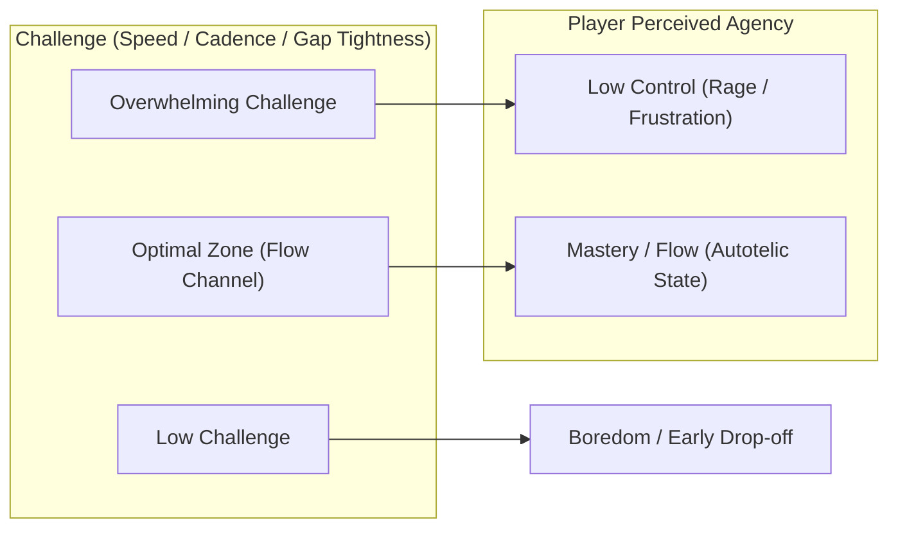
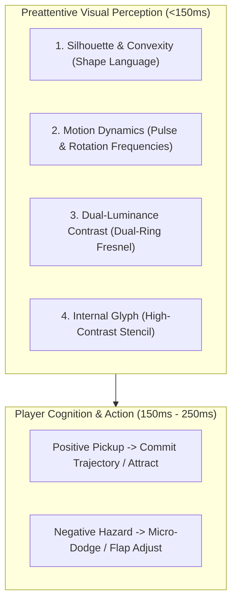

# Flow-State Psychology & Arcade Systems Design Specification

**Target Platform:** 60–120fps 3D Side-Scrolling Tap-to-Flap Flyer (*FLOPY.SPACE* archetype)  
**Date:** 2026-08-24  
**Status:** Approved Architectural Specification

---

## 1. Executive Summary: The Psychology of Flow vs. Rage

In high-speed one-button arcade games (*Flappy Bird*, *Geometry Dash*, *Jetpack Joyride*, *Subway Surfers*), the boundary between **Flow** (Csikszentmihalyi’s channel of heightened arousal and perceived mastery) and **Rage-Quitting** (amygdala hijack triggered by perceived unfairness) is measured in **milliseconds and sub-unit hitboxes**.



To create an addiction-loop flyer that players replay 50+ times in a single sitting, the design harmonizes:
1. **Perceptual-Motor Timing Windows** (Human Reaction: $200\text{--}280\text{ms}$; Flap Physics Arc: $t_{\text{apex}} \approx 340\text{ms}$).
2. **Predictive Agency** (Fairness Invariants: Asymmetric hitboxes, deterministic wander, safe runway recovery).
3. **Micro-Decision Risk/Reward Economies** (Positive dopamine bursts vs. voluntary, high-yield debuff hazards).
4. **Tension-Release Biological Pacing** (Sympathetic arousal spikes followed by parasympathetic breather runways).

---

## 2. Difficulty Curve & Anti-Rage Formulations

### 2.1 Kinematic Trajectory Envelope & Hitbox Clearance

At $120\text{Hz}$ ($\Delta t = 8.33\text{ms}$), jumping physics follows ballistic integration:
$$v(t) = v_{\text{flap}} + g \cdot t, \quad y(t) = y_0 + v_{\text{flap}} t + \frac{1}{2} g t^2$$

- Gravity $g = -22.0\text{ m/s}^2$
- Flap impulse $v_{\text{flap}} = +7.5\text{ m/s}$
- Time to apex: $t_{\text{apex}} = \frac{|v_{\text{flap}}|}{|g|} = \frac{7.5}{22.0} \approx 0.341\text{ s} \; (41 \text{ ticks})$
- Jump apex height: $\Delta y_{\text{apex}} = \frac{v_{\text{flap}}^2}{2 |g|} = \frac{56.25}{44.0} \approx 1.278\text{ m}$

### 2.2 Asymptotic Sigmoidal Speed Scaling

Pure linear difficulty curves ($v = v_0 + k \cdot s$) fail because they quickly exceed human motor thresholds. The golden curve is an **Asymptotic Sigmoidal Curve** that plateaus at human mastery limits ($12.0\text{ m/s}$), shifting high-score difficulty from raw speed to spatial nuance:

$$v(s) = v_{\text{base}} + (v_{\text{max}} - v_{\text{base}}) \cdot \frac{s^{1.6}}{s^{1.6} + 32^{1.6}}$$

- $v_{\text{base}} = 6.0\text{ m/s}$, $v_{\text{max}} = 12.0\text{ m/s}$, $s_{\text{mid}} = 32$.
- At $s=0 \implies v = 6.0\text{ m/s}$ ($1.83\text{s}$ per pipe).
- At $s=32 \implies v = 9.0\text{ m/s}$ ($1.22\text{s}$ per pipe).
- At $s=60 \implies v = 10.8\text{ m/s}$ ($1.01\text{s}$ per pipe).
- Asymptotic ceiling: $12.0\text{ m/s}$ ($0.92\text{s}$ per pipe).

### 2.3 Tension-Release Breather Cycles (The 15-Pipe Cadence)

The human sympathetic nervous system cannot sustain peak vigilance beyond $15\text{--}20\text{ seconds}$ without attention fatigue leading to erratic motor spasms.
- **Trigger**: Every **15 pipes passed**.
- **Breather Parameters**:
  - 2 consecutive pipes with Gap Height $= 4.8\text{m}$ (vs normal $2.85\text{--}3.2\text{m}$).
  - Gap Wander $\Delta Y = 0.0\text{m}$ (flat horizon).
  - Ambient lighting brightens, subtle chime plays.
  - Spawns gentle score collectibles along a natural parabola.

---

## 3. Quadruple-Coded Collectibles & Hazards System

In high-speed arcade flyers ($6\text{m/s} \to 12\text{m/s}$ scroll speed, $120\text{Hz}$ simulation), visual recognition must occur within the **preattentive visual processing window ($<150\text{ms}$)**.



### 3.1 Collectibles Matrix: Risk vs. Reward

| Orb / Hazard Type | Category | 3D Shape & Silhouette | Color Hex & Luminance ($L^*$) | Internal Glyph & Visual Behavior | Gameplay Effect & Micro-Decision |
| :--- | :--- | :--- | :--- | :--- | :--- |
| **Chrono Clock** | Positive Buff | Smooth Sphere + Concentric Ring | Cyan `#00E5FF` ($L^*=83.5$) | `⏱️` Dial, Counter-clockwise sweep | Slows game to $0.35\times$ for $3.0\text{s}$, restores heartbeat. |
| **Star Shield** | Positive Buff | Shimmering Dual Sphere + Gem | Radiant Gold `#FFD700` ($L^*=84.2$) | `🛡️` Crest, Faceted rotation | Absorbs 1 fatal pipe crash with golden shatter VFX. |
| **Rainbow Prism** | Positive Buff | Faceted Octahedron + Radiant Halo | Electric Pink `#FF007F` ($L^*=62.1$) | `🌈` Refraction, Color-cycling prism | Leaves glowing trajectory trail + $3\times$ points for $7\text{s}$. |
| **Super Magnet** | Positive Buff | Nested Double Torus Ring | Neon Mint `#00F5D4` ($L^*=86.4$) | `🧲` Horseshoe, Pulsing gravitational rings | Vacuums all nearby orbs/feathers in an $8\text{m}$ radius for $6\text{s}$. |
| **Star Gem** | Positive Instant | 12-sided Dodecahedron Star | Warm Amber `#FFBE0B` ($L^*=81.0$) | `⭐` 5-Star facet, Sparkle burst | Awards $+5\text{ bonus score}$ and immediately boosts combo $+1$. |
| **Void Mine** | Hazard / Dodge | 12-Spike Stellated Urchin | Spiked Obsidian `#1B0A2A` + Crimson `#FF2A6D` | `💀` Danger Skull, Erratic $12\text{Hz}$ jitter | **DODGE!** If hit: Breaks combo spree, loses $-3$ bonus points, screen flashes warning red. |
| **Heavy Gravity** | Hazard / Dodge | Sharp Obsidian Cube with Barbed Corners | Electric Violet `#9D4EDD` + Black Core | `⚓` Heavy Anvil, Downward pulsing gravity ripples | **DODGE!** If hit: Increases downward gravity by $+40\%$ for $2.5\text{s}$ (demands rapid recovery flaps). |
| **Speed Surge** | Hazard / Wager | Razor Tetrahedron with Sawtooth Fins | Warning Amber-Orange `#FF8800` | `⚡` Hazard Chevrons, Strobe spin | **RISK/REWARD!** Surges speed to $14\text{m/s}$ for $2.5\text{s}$; clearing pipes while active gives $+3\text{ bonus pts}$ each. |

---

## 4. Accessibility (a11y) & Universal Colorblindness (CVD)

- **Universal CVD Compatibility**: Fully tested against Deuteranopia, Protanopia, Tritanopia, and Monochromacy.
- **Dual-Ring Inversion Fresnel**: Outer luminous additive halo ($\Delta L^* \ge 40$) paired with inner dark rim ensures $100\%$ visibility against all biomes from Dawn to Deep Night.
- **WCAG 2.2 AAA Standard**: High luminance contrast separation ($L^* \ge 81$ for buffs vs $L^* \le 20$ for hazard cores).

---

## 5. Zero-Occlusion Spatial HUD & Sightline Invariants

```
+-------------------------------------------------------------------------------+
| TOP HUD: [🌿 Meadow • 01:24]         [ SCORE: 42 ]         [ 🪶 2/3 ]          |
| [================== SLOW-MO METER 65% ===================]                   |
|                                                                               |
|   CEILING y = +3.5 --------------------------------------------------------   |
|                                                                               |
|      [BIRD] ---->   === FLIGHT TRAJECTORY FUNNEL ===>   [PIPE GAP]            |
|       (x=0)        *** NO IN-WORLD FLOATING TEXT ***     (x=8..16)            |
|                     *** 100% SIGHTLINE CLARITY ***                            |
|                                                                               |
|   GROUND y = -3.5 ---------------------------------------------------------   |
|                                                                               |
| BOTTOM HUD:            [ 🛡️ SHIELD ACTIVE - Blocks 1 Crash ]                  |
+-------------------------------------------------------------------------------+
```

1. **Pre-Pickup Clarity**: Zero in-world text labels on approaching 3D orbs.
2. **Post-Pickup Trailing Feedback**: Floating score/buff popups spawn strictly behind bird ($x \le -0.5\text{m}$) and float upward toward ceiling ($y \ge +3.0\text{m}$).
3. **Safe-Area Docked Toasts**: Transient power-up notifications display exclusively at bottom center dock (`bottom: max(20px, env(safe-area-inset-bottom))`).
